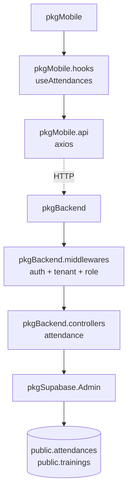
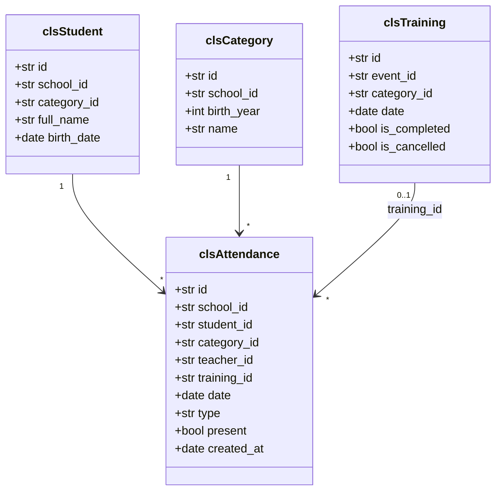
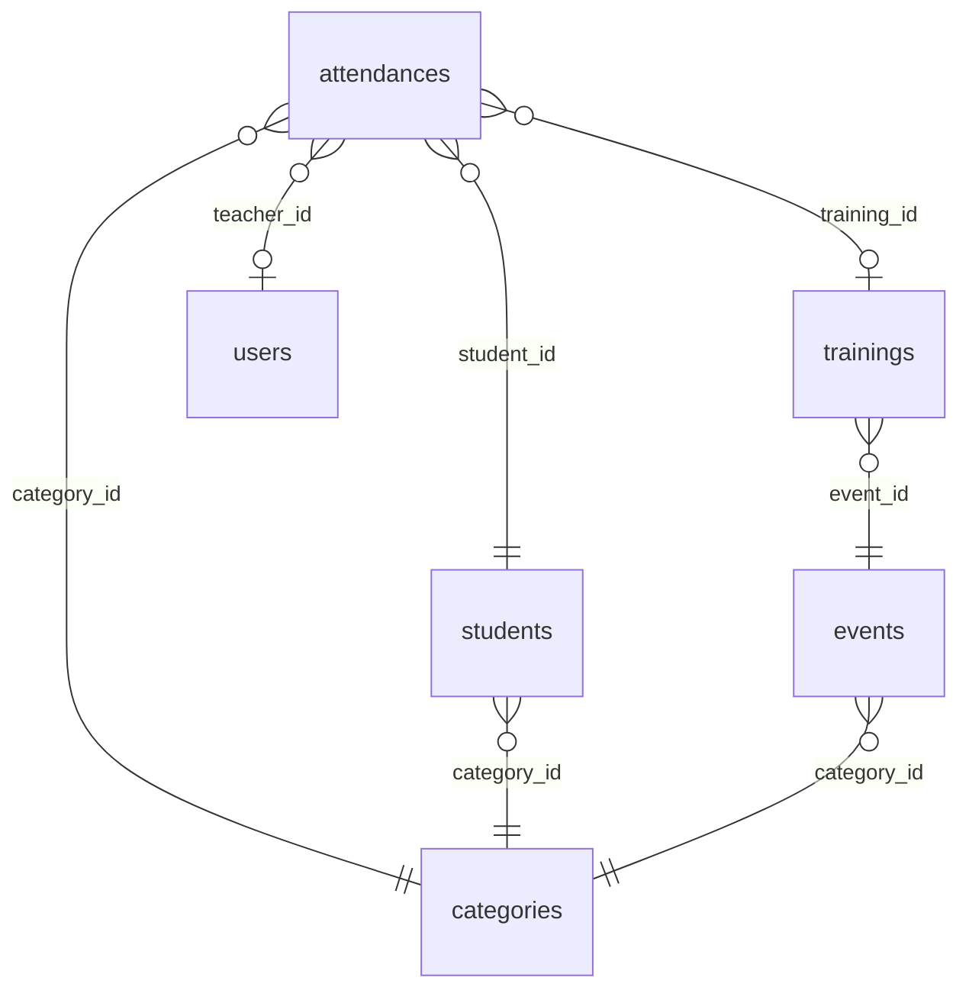
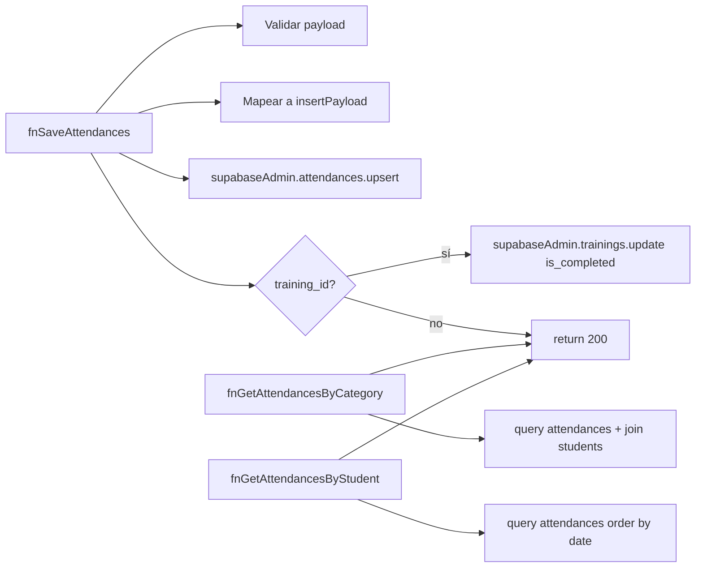
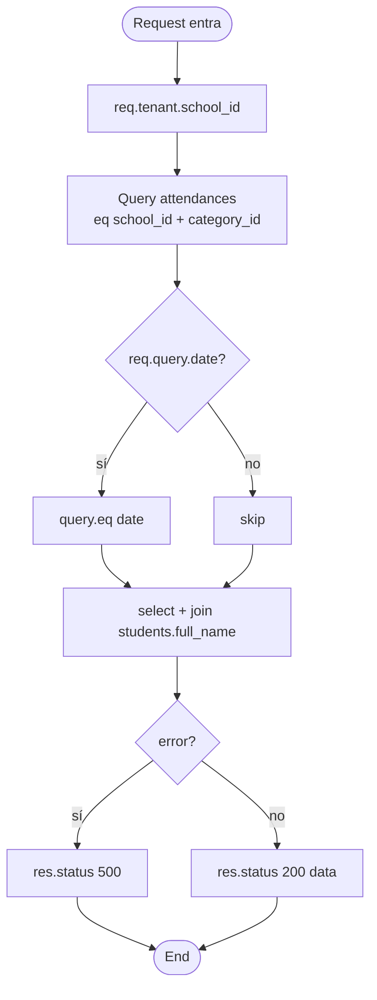
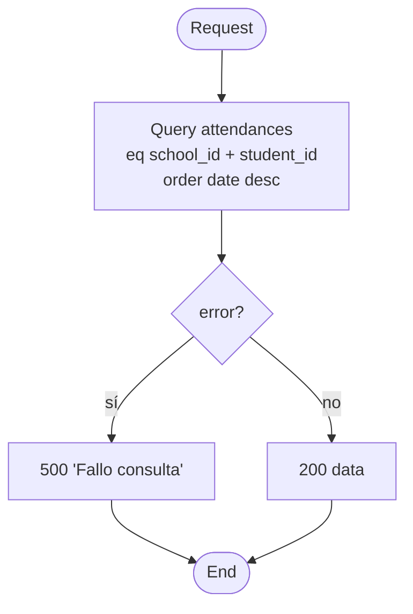
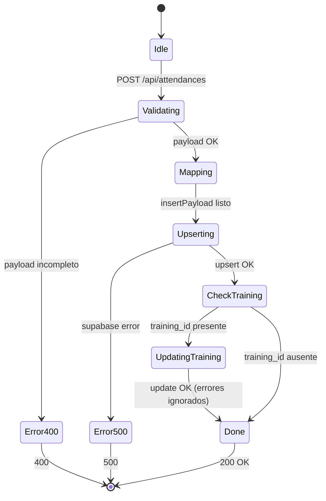
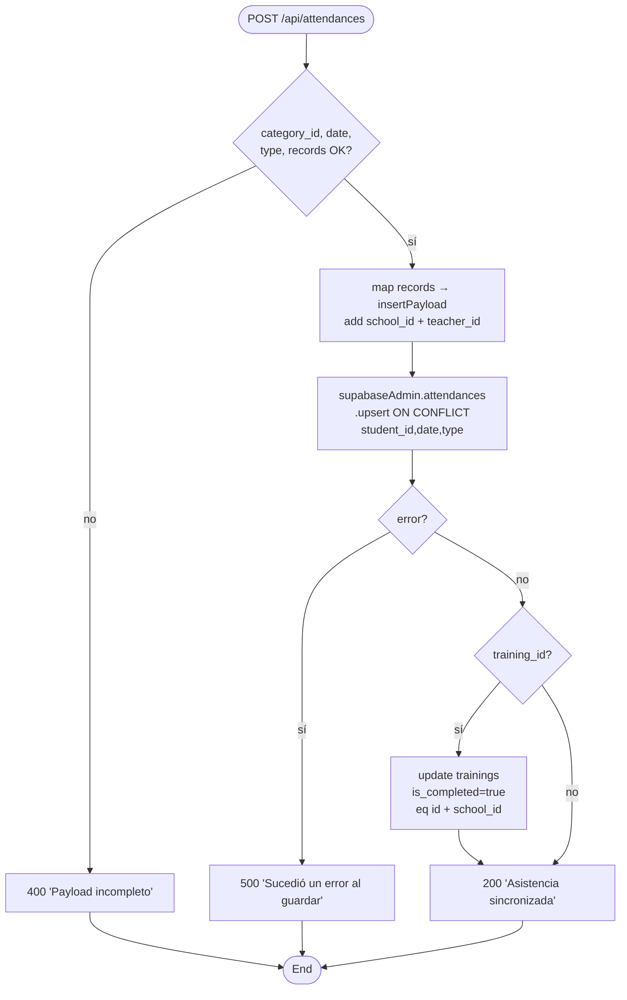

# SW Design Description (SDD) — Futcamedic

**Title:** Futcamedic — SW Component `swcAttendanceController` (Funcionalidad: Registro de Asistencias)
**Sección:** D15 · **Equipo:** 6 · **Término:** 2026
**Documento:** P03-SDD_SecD15_Team6_Functionality

## History

| Issue status (Index) | Maturity/Date | Author | Department | Check/Release | Description |
|---|---|---|---|---|---|
| 1.0 | Valid — 22-Apr-2026 | Christian A. Ramos Pérez | TEC-IDS | TEC-IDS | Diseño detallado del componente Attendance. |

## Table of Contents

1. Purpose
2. Definitions and Abbreviations
3. References
4. Realization Constraints and Targets
5. SW Conceptual Design
6. SW Component Internal Breakdown
   - 6.1 Functional Decomposition
   - 6.2 Functions — Description and Dynamic Behavior

## 1. Purpose

Describir el diseño detallado del componente `swcAttendanceController` (y sus vecinos directos `swcMobileHooks::useAttendances`, `swcAttendanceScreen`) que implementa el registro de asistencias en Futcamedic. El SDD baja desde la arquitectura (P03-SWA) hasta la descripción de cada función pública, sus parámetros, pre/post-condiciones, errores y comportamiento dinámico.

## 2. Definitions and Abbreviations

### Definitions

| Término | Descripción |
|---|---|
| `iAttendanceRecord` | `{ student_id: str, present: b }` — record individual de asistencia en el batch. |
| `iAttendanceBatch` | `{ category_id, date, type, training_id?, records: arr<iAttendanceRecord> }`. |
| Upsert | `INSERT … ON CONFLICT (student_id,date,type) DO UPDATE SET present=EXCLUDED.present`. |

### Abbreviations

| Abrev. | Significado |
|---|---|
| RLS | Row Level Security |
| JWT | JSON Web Token |
| RBAC | Role-Based Access Control |
| SWC | SW Component |

## 3. References

| N° | Document name | Reference |
|---|---|---|
| 1 | SW Architecture | `P03-SWA_SecD15_Team6.md` |
| 2 | Source code | `backend/api/controllers/attendance.controller.ts` |
| 3 | Middlewares | `backend/api/middlewares/auth.middleware.ts`, `backend/api/middlewares/tenant.middleware.ts` |
| 4 | Schema | `schema.sql` (tabla `attendances` líneas 70-82) |
| 5 | Mobile hook | `mobile/src/hooks/useAttendances.ts` |

## 4. Realization Constraints and Targets

- Una única fila por `(student_id, date, type)` — constraint UNIQUE en DB (`schema.sql:81`).
- Sólo usuarios con rol `super_admin`, `admin` o `profesor` pueden invocar `fnSaveAttendances` (RBAC).
- Toda consulta/escritura filtra por `school_id` (multi-tenant).
- Insert batch: soportar hasta N=60 records en una sola request (típico en una categoría grande).
- Marcar la sesión (`trainings.is_completed`) al guardar, si se pasó `training_id`.
- Response time objetivo: p95 < 500 ms (batch de 30 records).

## 5. SW Conceptual Design

### 5.1 Package Diagram



### 5.2 Class Diagram (entidades involucradas)



### 5.3 ERD simplificado



### 5.4 System Boundary

Dentro del boundary: `swcAttendanceController`, `swcAuthMiddleware`, `swcTenantMiddleware`.
Fuera del boundary: Postgres (accedido vía `swcSupabaseAdmin`), Supabase Auth (token source), cliente mobile.

## 6. SW Component Internal Breakdown

El SWC no se subdivide en subcomponentes; está representado por un único object file (`attendance.controller.ts`), que exporta 3 funciones públicas.

### 6.1 Functional Decomposition (Static Function Diagram)



### 6.2 Function Description and Dynamic Behavior

---

#### 6.2.1 Function `async fnGetAttendancesByCategory(req, res) → pVoid`

**Signature (código real, `attendance.controller.ts:4-25`):**

```ts
export const getAttendancesByCategory = async (req: Request, res: Response) => { ... }
```

| Campo | Detalle |
|---|---|
| **Description** | Retorna todas las asistencias de una categoría, filtrables opcionalmente por fecha. Incluye el nombre del alumno via inner join a `students`. |
| **Parameter 1 — req.params.id** `<input: str>` | UUID de la categoría. El controlador confía en que el router ya lo valida; si la categoría no es del tenant, RLS lo filtra. |
| **Parameter 2 — req.query.date** `<input: str?>` | Fecha ISO (`YYYY-MM-DD`) opcional. No sanitizada: si el cliente manda basura, Supabase devuelve 0 rows (no 500). |
| **Parameter 3 — req.tenant** `<input: iTenantContext>` | Inyectado por `requireTenant`. Aporta `school_id`. |
| **Return Value** | `Response JSON 200` con `arr<iAttendanceWithStudent>` (spread de attendance + `student.full_name`). `500` en error. |
| **Precondition** | Request pasó por `requireAuth` → `requireTenant`. `req.tenant.school_id` existe. |
| **Post condition** | Ninguna mutación de estado. |
| **Error Conditions** | `500 { error: 'Error al obtener asistencias.' }` si Supabase falla. `500 { error: 'Error interno.' }` si excepción. |
| **Requirements** | REQ-ATT-01 (consulta asistencias por categoría), REQ-MT-01 (aislamiento por school_id). |

**Dynamic Behavior — Flow Chart:**



---

#### 6.2.2 Function `async fnGetAttendancesByStudent(req, res) → pVoid`

**Signature (`attendance.controller.ts:27-44`):**

```ts
export const getAttendancesByStudent = async (req: Request, res: Response) => { ... }
```

| Campo | Detalle |
|---|---|
| **Description** | Devuelve el historial de asistencias de un alumno (ordenado desc por fecha). |
| **Parameter 1 — req.params.id** `<input: str>` | UUID del alumno. |
| **Parameter 2 — req.tenant** `<input: iTenantContext>` | — |
| **Return Value** | `Response JSON 200 arr<iAttendance>`. |
| **Precondition** | Autenticado, tenant válido. Alumno debe pertenecer a la misma escuela (RLS + filtro explícito). |
| **Post condition** | Sin mutaciones. |
| **Error Conditions** | `500 { error: 'Fallo consulta.' }`; excepción → `500 { error: 'Error servidor.' }`. |
| **Requirements** | REQ-ATT-02 (historial alumno), REQ-MT-01. |

**Flow Chart:**



---

#### 6.2.3 Function `async fnSaveAttendances(req, res) → pVoid`

**Signature (`attendance.controller.ts:46-85`):**

```ts
export const saveAttendances = async (req: Request, res: Response) => { ... }
```

| Campo | Detalle |
|---|---|
| **Description** | Upsert batch de asistencias para una (categoría, fecha, tipo). Si se provee `training_id`, marca la sesión como completada. |
| **Parameter 1 — req.body.category_id** `<input: str>` | UUID categoría. Requerido. |
| **Parameter 2 — req.body.date** `<input: str>` | ISO `YYYY-MM-DD`. Requerido. |
| **Parameter 3 — req.body.type** `<input: str>` | `'entrenamiento'` \| `'partido'`. Requerido. |
| **Parameter 4 — req.body.records** `<input: arr<iAttendanceRecord>>` | `[{student_id, present}, ...]`. Debe ser array. |
| **Parameter 5 — req.body.training_id** `<input: str?>` | UUID de sesión; opcional. |
| **Parameter 6 — req.tenant** `<input: iTenantContext>` | Aporta `school_id` y `user_id` (teacher_id). |
| **Return Value** | `200 { message: 'Asistencia sincronizada.' }` o `4xx/500`. |
| **Precondition** | `requireAuth → requireTenant → requireRole('super_admin','admin','profesor')`. `records` es array no vacío (debería validarse — ver Code Review §1). |
| **Post condition** | Filas upsertadas en `attendances`. Si `training_id` provisto: `trainings.is_completed = true`. |
| **Error Conditions** | `400 { error: 'Payload incompleto.' }` si falta campo o records no es array. `500 { error: 'Sucedió un error al guardar.' }` si upsert falla. `500 { error: 'Excepción servidor.' }` si excepción. |
| **Requirements** | REQ-ATT-03 (pase de lista batch), REQ-ATT-04 (marcar sesión completada), REQ-MT-01 (aislamiento). |

**State Chart:**



**Flow Chart:**



**Fragmento de código (real, `attendance.controller.ts:54-80`):**

```ts
const insertPayload = records.map((r: any) => ({
  school_id,
  category_id,
  student_id: r.student_id,
  teacher_id: user_id,
  date,
  type,
  present: r.present,
  training_id: training_id || null
}));

const { error } = await supabaseAdmin
  .from('attendances')
  .upsert(insertPayload, { onConflict: 'student_id,date,type' });

if (error) return res.status(500).json({ error: 'Sucedió un error al guardar.' });

if (training_id) {
  await supabaseAdmin
    .from('trainings')
    .update({ is_completed: true })
    .eq('id', training_id)
    .eq('school_id', school_id);
}
```

**Observación de diseño:** el `update` del training no está dentro de una transacción con el upsert de attendances. Si el upsert tiene éxito y el update falla (o viceversa), la consistencia se pierde. Documentado como (E) Risk en Code Review.

---

## Trazabilidad Requisitos → Funciones → SWC

| Requisito | Función | SWC |
|---|---|---|
| REQ-ATT-01 (listar por categoría) | `fnGetAttendancesByCategory` | `swcAttendanceController` |
| REQ-ATT-02 (historial por alumno) | `fnGetAttendancesByStudent` | `swcAttendanceController` |
| REQ-ATT-03 (pase de lista batch) | `fnSaveAttendances` | `swcAttendanceController` |
| REQ-ATT-04 (completar sesión) | `fnSaveAttendances` (branch `training_id`) | `swcAttendanceController` |
| REQ-MT-01 (aislamiento multi-tenant) | Todas | `swcTenantMiddleware` + RLS |
| REQ-SEC-01 (RBAC) | Todas (guard con `requireRole`) | `swcTenantMiddleware::requireRole` |
