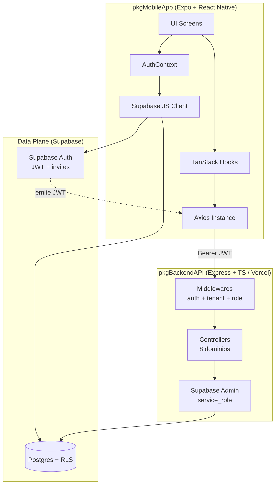
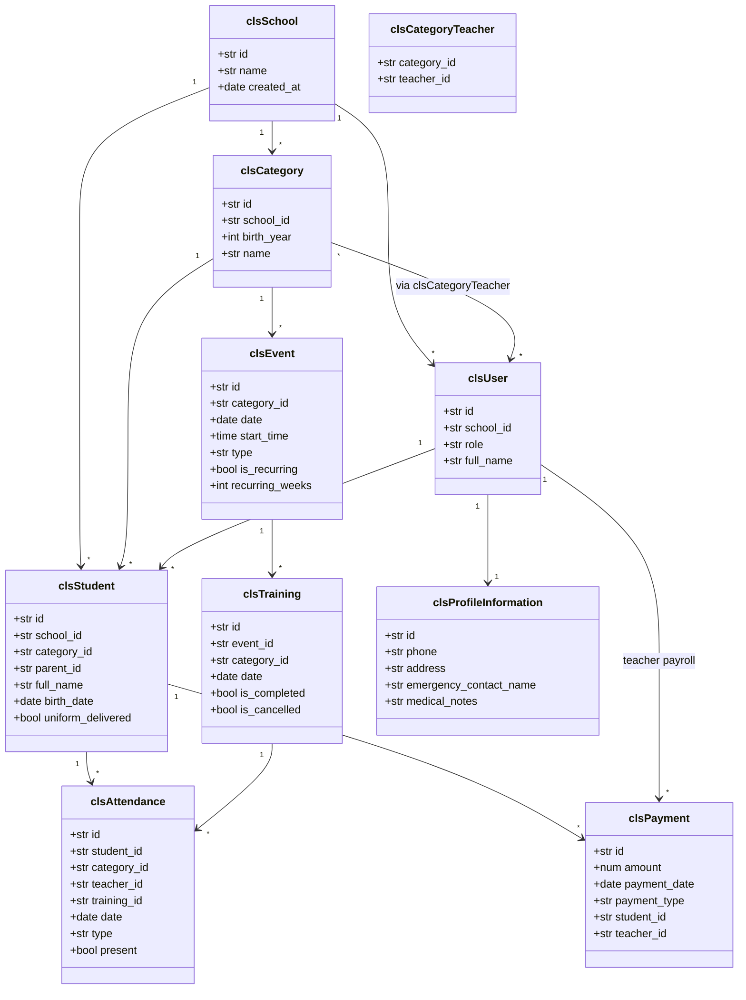
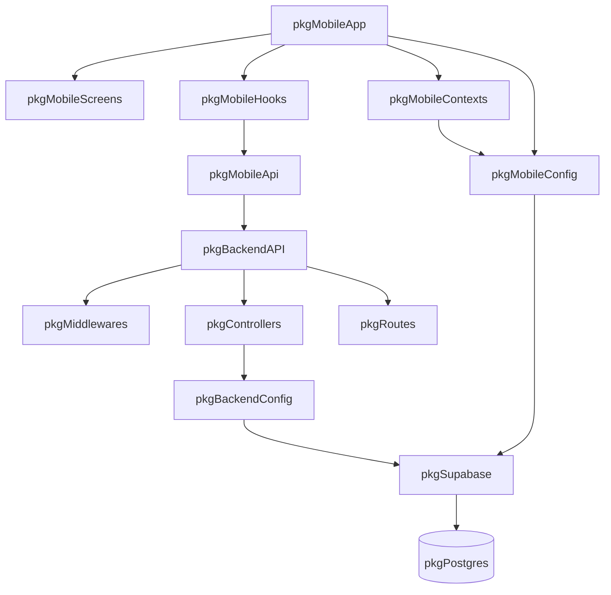
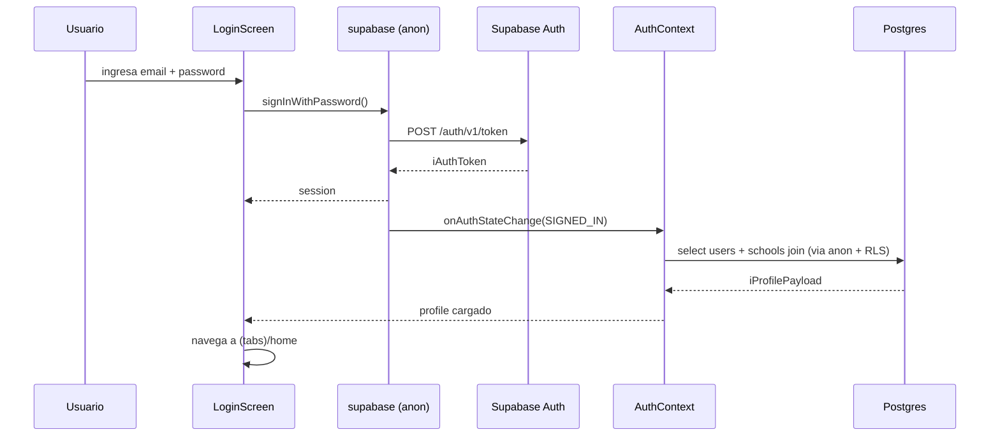
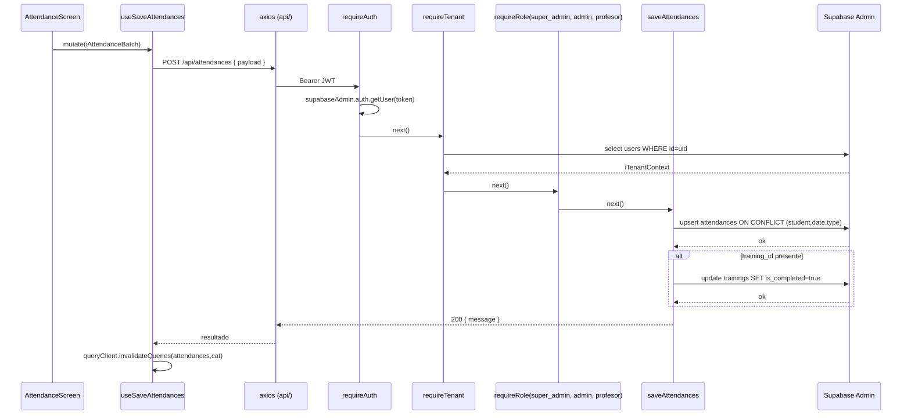

# SW Architecture — Futcamedic

**Title:** Futcamedic — Sistema Multi-Tenant de Gestión de Academias de Fútbol
**Sección:** D15 · **Equipo:** 6 · **Término:** 2026
**Documento:** P03-SWA_SecD15_Team6

## History

| Issue status (Index) | Maturity/Date (draft/invalid/valid) | Author | Department | Check/Release Department | Description |
|---|---|---|---|---|---|
| 1.0 | Valid — 22-Apr-2026 | Christian A. Ramos Pérez | TEC-IDS | TEC-IDS | Arquitectura inicial Futcamedic |

## Table of Contents

1. Purpose
2. Definitions and Abbreviations
3. References
4. Realization Constraints and Targets
5. SW Functional Architecture
   - 5.1 Table of Functions
   - 5.2 Table of Functional Interfaces
   - 5.3 Functional Interface (Component Diagram)
   - 5.4 Functional Interaction (Class Diagram)
6. SW Physical Architecture
   - 6.1 Physical Decomposition
   - 6.2 Table of SW Components
   - 6.3 Table of Physical Interfaces
   - 6.4 Physical Interfaces
   - 6.5 Physical Interaction
   - 6.6 Dynamic Behavior
   - 6.7 Synchronization Mechanisms
7. Function to Physical Allocation
8. SW Requirements Allocation
9. SW Integration Plan

---

## 1. Purpose

Definir la última versión de la arquitectura del sistema **Futcamedic**, una aplicación SaaS multi-tenant para la gestión integral de academias de fútbol base. El sistema administra usuarios (admins, profesores, padres, alumnos), categorías por año de nacimiento, inscripción de alumnos, asistencias, pagos (mensualidades y pagos a profesores), eventos y agenda recurrente de entrenamientos/partidos. La arquitectura se deriva de los requisitos revisados en la traceability matrix y en la checklist de requisitos de SW.

## 2. Definitions and Abbreviations

### Definitions

| Término | Descripción |
|---|---|
| Tenant | Escuela/academia aislada; cada fila de cualquier tabla lleva `school_id`. |
| Training | Sesión individual (clase de un día) derivada de un Event maestro. |
| Event | Evento maestro de agenda; puede ser recurrente (genera N trainings). |
| Upsert | Operación DB de insert-or-update sobre constraint UNIQUE. |

### Abbreviations

| Abrev. | Significado |
|---|---|
| RLS | Row Level Security (Postgres policy). |
| RBAC | Role-Based Access Control. |
| JWT | JSON Web Token (Supabase Auth). |
| SWC | SW Component. |
| SDD | SW Design Description. |
| SWA | SW Architecture. |
| BFF | Backend For Frontend. |
| SaaS | Software as a Service. |
| PWA/SPA | (Not used; mobile Expo native). |

## 3. References

| N° | Document name | Reference |
|---|---|---|
| 1 | SW Requirements (P01) | Equipo D15-6, entregable previo |
| 2 | Traceability Matrix (P02) | Equipo D15-6, entregable previo |
| 3 | Schema de base de datos | `schema.sql` (raíz del repo) |
| 4 | Backend entry point | `backend/api/index.ts` |
| 5 | Mobile AuthContext | `mobile/src/contexts/AuthContext.tsx` |
| 6 | Supabase docs | https://supabase.com/docs |

## 4. Realization Constraints and Targets

### High-level project use cases description

Futcamedic opera y administra la operación diaria de una academia de fútbol base:

- Un sistema que aísla los datos de cada academia (tenant) por `school_id` en todas las tablas (strict multi-tenant).
- Un sistema que soporta 5 roles: `super_admin`, `admin`, `profesor`, `padre`, `alumno`.
- Un sistema que permite registrar una nueva academia sin intervención manual (self-service onboarding).
- Un sistema que permite a admins invitar profesores/padres por email (Supabase Auth invite).
- Un sistema que agenda entrenamientos y partidos con recurrencia semanal configurable.
- Un sistema que registra asistencias por sesión y marca la sesión como completada al guardar.
- Un sistema que gestiona pagos de mensualidades de alumnos y nómina de profesores.
- Un sistema responsivo tanto en iOS, Android como Web (mobile Expo + React Native Web).
- Un sistema seguro: JWT en cada request, RLS en cada tabla, role-check en endpoints sensibles.

## 5. SW Functional Architecture

Identificamos el comportamiento funcional que se implementa en Software a partir de los casos de uso (ver P01/P02 del equipo), las funciones de SW, sus interacciones y las señales/eventos que comparten.

### 5.1 Table of Functions

Notación Húngara (prefijo por tipo de retorno): `fn`=función, `p`=promise, `arr`=array, `obj`=object, `str`=string, `b`=bool, `i`=int.

| Function Name | Description |
|---|---|
| `fnAuthenticateUser(strToken) → pObjUser` | Valida JWT contra Supabase Auth e inyecta `req.user`. |
| `fnValidateTenant() → pObjTenant` | Resuelve `{school_id, role, user_id}` del usuario autenticado. |
| `fnCheckRole(arrRoles) → fnMiddleware` | Factory que retorna middleware de RBAC. |
| `fnRegisterSchool(objPayload) → pObjResult` | Crea `schools`, registra usuario en `auth.users` como admin inicial. |
| `fnInviteUser(objPayload) → pObjResult` | Invita profesor/padre/alumno vía Supabase Auth invite email. |
| `fnGetStudents() → pArrStudents` | Lista alumnos del tenant. |
| `fnCreateStudent(objPayload) → pObjStudent` | Alta de alumno con categoría y parent_id opcional. |
| `fnUpdateStudent(strId, objPayload) → pObjStudent` | Edita datos de alumno. |
| `fnUpdateUniform(strId, bDelivered) → pObjStudent` | Marca uniforme entregado. |
| `fnGetAttendancesByCategory(strCategoryId, strDate) → pArrAttendances` | Consulta asistencias por categoría y fecha. |
| `fnGetAttendancesByStudent(strStudentId) → pArrHistory` | Historial individual. |
| `fnSaveAttendances(objPayload) → pObjResult` | Upsert batch de asistencias + marca training completado. |
| `fnGetEvents(strCategoryId?) → pArrEvents` | Lista eventos maestros. |
| `fnCreateEvent(objPayload) → pObjEvent` | Crea evento maestro y genera N trainings recurrentes. |
| `fnDeleteEvent(strId) → pObjResult` | Elimina evento (cascade trainings). |
| `fnGetTrainingsForDay(strDate, strCategoryId?) → pArrTrainings` | Lista sesiones del día (filtra por categorías asignadas si es profesor). |
| `fnGetTrainingsByEvent(strEventId) → pArrTrainings` | Lista todas las sesiones generadas de un evento. |
| `fnCancelInstance(objPayload) → pObjResult` | Cancela una sesión específica sin borrar el evento maestro. |
| `fnGetPayments(strType?) → pArrPayments` | Lista pagos (mensualidad / pago_profesor). |
| `fnGetPaymentsByStudent(strId) → pArrPayments` | Historial de pagos por alumno. |
| `fnRegisterStudentPayment(objPayload) → pObjPayment` | Registra mensualidad. |
| `fnRegisterTeacherPayment(objPayload) → pObjPayment` | Registra pago a profesor. |
| `fnGetCategories() → pArrCategories` | Lista categorías del tenant. |
| `fnGetMyCategoriesAsTeacher() → pArrCategories` | Categorías asignadas al profesor autenticado. |
| `fnCreateCategory(objPayload) → pObjCategory` | Alta de categoría por año de nacimiento. |
| `fnUpdateCategory(strId, objPayload) → pObjCategory` | Edita categoría. |
| `fnAssignTeacher(strCategoryId, strTeacherId) → pObjResult` | Vincula profesor a categoría (`category_teachers`). |
| `fnGetUsers() → pArrUsers` | Lista usuarios del tenant. |
| `fnGetTeachers() → pArrTeachers` | Filtro de usuarios con rol profesor. |
| `fnGetTeacherDetails(strId) → pObjTeacher` | Detalle + categorías asignadas. |
| `fnUpdateUser(strId, objPayload) → pObjUser` | Edita usuario. |
| `fnChangeOwnPassword(strNewPassword) → pObjResult` | Self-service password change. |
| `fnUpdateSchool(objPayload) → pObjSchool` | Actualiza nombre/logo de la academia. |
| `fnFetchProfile(strUserId) → pObjProfile` | Mobile: carga `users` + `schools` join. |
| `fnRefreshSession() → pObjSession` | Mobile: Supabase auto-refresh token. |
| `fnAxiosInterceptor(objConfig) → pObjConfig` | Mobile: inyecta `Bearer` en cada request. |

### 5.2 Table of Functional Interfaces

Señales/eventos (estructuras de datos que fluyen entre funciones):

| Signal/Event | Description |
|---|---|
| `iAuthToken` | `{ access_token: str, refresh_token: str, expires_at: i }` — JWT emitido por Supabase Auth. |
| `iTenantContext` | `{ school_id: str, role: str, user_id: str }` — contexto inyectado tras `fnValidateTenant`. |
| `iStudentRecord` | `{ id, school_id, category_id, parent_id?, full_name, birth_date, uniform_delivered: b }`. |
| `iAttendanceBatch` | `{ category_id, date, type, training_id?, records: arr<{student_id, present: b}> }`. |
| `iEventSchedule` | `{ category_id, date, start_time?, type, description?, recurringWeeks?: i }`. |
| `iPaymentRecord` | `{ amount: num, payment_date, payment_type, student_id?, teacher_id?, description? }`. |
| `iCategoryAssignment` | `{ category_id, teacher_id }`. |
| `iProfilePayload` | Join user + school para UI. |
| `iSessionChangeEvent` | Payload de `supabase.auth.onAuthStateChange`. |

### 5.3 Functional Interface (Component Diagram)



### 5.4 Functional Interaction (Class Diagram)



## 6. SW Physical Architecture

Define la arquitectura física y la descomposición del software en SWCs, sus interacciones y las señales/eventos compartidos.

### 6.1 Physical Decomposition (Packages Diagram)



### 6.2 Table of SW Components

| SWC Name | Description | Estimated Size (KB) |
|---|---|---|
| `swcAuthController` | Registro de academia (`fnRegisterSchool`) e invitación de usuarios (`fnInviteUser`). | 4 |
| `swcUserController` | CRUD usuarios, detalle de profesor, cambio de contraseña. | 5 |
| `swcStudentController` | Alta/edición de alumnos, uniforme, detalle. | 5 |
| `swcCategoryController` | Categorías por birth_year, asignación de profesores. | 4 |
| `swcAttendanceController` | Upsert batch + marca training completado. | 3 |
| `swcEventController` | Eventos maestros + generación de trainings recurrentes + cancelación de instancia. | 7 |
| `swcPaymentController` | Pagos de alumno (mensualidad) y de profesor (nómina). | 4 |
| `swcSchoolController` | Update de nombre/logo de academia. | 2 |
| `swcAuthMiddleware` | Valida JWT Supabase (`fnAuthenticateUser`). | 2 |
| `swcTenantMiddleware` | `requireTenant` + factory `requireRole`. | 2 |
| `swcSupabaseAdmin` | Cliente Supabase con service_role key (server-only). | 1 |
| `swcRouter` | `backend/api/routes/index.ts` — monta 8 subrouters. | 3 |
| `swcExpressApp` | `backend/api/index.ts` — CORS, JSON, health. | 1 |
| `swcMobileSupabase` | `mobile/src/config/supabase.ts` con AsyncStorage adapter. | 2 |
| `swcMobileAxios` | `mobile/src/api/axios.ts` con Bearer interceptor. | 1 |
| `swcMobileAuthContext` | Sesión + profile + `onAuthStateChange`. | 3 |
| `swcMobileHooks` | 7 hooks TanStack (useStudents, useAttendances, usePayments, useEvents, useCategories, useUsers, useSettings). | 12 |
| `swcMobileScreens` | `(tabs)/` + `admin/` + auth screens (20+ pantallas). | 40 |

### 6.3 Table of Physical Interfaces

| Operation | Description |
|---|---|
| `iAuthMiddleware` | `requireAuth(req, res, next)` — lee header `Authorization`. |
| `iTenantMiddleware` | `requireTenant(req, res, next)` — setea `req.tenant`. |
| `iRoleMiddleware` | `requireRole(...roles)` — factory. |
| `iRestAPI` | HTTP REST endpoints bajo `/api/*`. |
| `iSupabaseAdmin` | `supabaseAdmin.from(...).select()/insert()/update()/upsert()`. |
| `iSupabaseClient` | Mobile: `supabase.auth.*`, `supabase.from(...)` con anon key. |
| `iAxiosInstance` | `api.get/post/put/delete` con Bearer auto-inyectado. |
| `iQueryClient` | `useQuery`/`useMutation` de TanStack Query. |
| `iAuthStateChange` | Callback sub de Supabase Auth. |

### 6.4 Physical Interfaces (archivos y métodos)

```
backend/api/
├── index.ts                     # swcExpressApp — exporta handler Vercel
├── routes/index.ts              # swcRouter — mounting
├── middlewares/
│   ├── auth.middleware.ts       # requireAuth
│   └── tenant.middleware.ts     # requireTenant, requireRole (factory)
├── controllers/
│   ├── auth.controller.ts       # registerSchool, inviteUser
│   ├── user.controller.ts       # getUsers, getTeacherDetails, changeOwnPassword, updateUser
│   ├── student.controller.ts    # getStudents, createStudent, updateStudent, updateUniform, getStudentDetails
│   ├── category.controller.ts   # getCategories, createCategory, updateCategory, assignTeacher, getMyCategoriesAsTeacher
│   ├── attendance.controller.ts # getAttendancesByCategory, getAttendancesByStudent, saveAttendances
│   ├── event.controller.ts      # getEvents, createEvent, deleteEvent, getTrainingsForDay, getTrainingsByEvent, cancelInstance
│   ├── payment.controller.ts    # getPayments, getPaymentsByStudent, registerStudentPayment, registerTeacherPayment
│   └── school.controller.ts     # updateSchool
└── config/supabase.ts           # swcSupabaseAdmin

mobile/
├── app/
│   ├── (tabs)/                  # home, attendance, finances, profile
│   ├── admin/                   # students, teachers, events, categories, settings/*
│   ├── login.tsx / register.tsx / change-password.tsx
├── src/
│   ├── api/axios.ts             # swcMobileAxios
│   ├── config/supabase.ts       # swcMobileSupabase
│   ├── contexts/AuthContext.tsx # swcMobileAuthContext
│   └── hooks/                   # swcMobileHooks (7 archivos)
```

### 6.5 Physical Interaction (Sequence Diagrams)

**Login end-to-end:**



**Creación de asistencia batch:**



### 6.6 Describe Dynamic Behavior

#### 6.6.1 Event Periodicity

Futcamedic no es un sistema RTOS; corre sobre Node.js serverless (Vercel) y Expo RN. Las tareas periódicas relevantes son:

| Event | Description | Periodicity | Period | Priority | CPU Load |
|---|---|---|---|---|---|
| `fnRefreshSession` | Supabase auto-refresh JWT antes de expirar. | ~55 min | 3300 s | Media | <1% |
| `fnQueryFocusRefetch` | TanStack Query refetch on focus (mobile FG). | Event-driven | N/A | Baja | <2% |
| `fnAuthStateSubscription` | Callback de `onAuthStateChange`. | Event-driven | N/A | Alta | <1% |
| `fnAxiosInterceptor` | Inyección de token en cada request. | Per-request | N/A | Alta | <1% |
| `fnHealthCheck` | `GET /api/health` (monitor externo). | Bajo demanda | N/A | Baja | <1% |

#### 6.6.2 Interrupt Handling

No hay ISRs clásicas. Los equivalentes event-driven:

| ISR-equivalent | Description | Priority | CPU Load |
|---|---|---|---|
| `onAuthStateChange` | Interrumpe flujo de UI al detectar login/logout y recarga profile. | Alta | <1% |
| `AppState change` (Expo) | Foreground/background → invalida queries. | Media | <1% |
| HTTP error 401 | Interrumpe request; Axios puede trigger logout. | Alta | <1% |

#### 6.6.3 Power Modes

| Modo | Descripción |
|---|---|
| **Foreground** | App activa; sesión refresca automáticamente; queries se revalidan en focus. |
| **Background** | Expo suspende el JS runtime; AsyncStorage persiste session; al volver a FG re-hidrata. |
| **Serverless idle (backend)** | Vercel hiberna funciones sin tráfico; cold start ~300 ms en primer request. |

### 6.7 Synchronization Mechanisms

- **UNIQUE constraints** en DB: `(school_id, birth_year)` en categories, `(category_id, teacher_id)` en category_teachers, `(student_id, date, type)` en attendances → habilitan upsert idempotente.
- **Row Level Security (RLS)**: toda lectura/escritura a Postgres vía anon key está limitada a `school_id` del `auth.uid()` (ver `schema.sql:173-210`).
- **JWT expiry + refresh**: ventana corta de validez del access_token (~1 h) con refresh_token rotation.
- **TanStack Query cache invalidation**: mutaciones llaman `queryClient.invalidateQueries(['attendances', category_id])` etc. para mantener UI sincronizada.
- **Supabase `onAuthStateChange`**: pub/sub bus para mantener AuthContext coherente ante login/logout/refresh.

## 7. Function to Physical Allocation

Cada `fn*` se aloca a un `swc*`:

| Function (SYS Level) | SW component | Clarification |
|---|---|---|
| `fnAuthenticateUser` | `swcAuthMiddleware` | — |
| `fnValidateTenant` | `swcTenantMiddleware` | — |
| `fnCheckRole` | `swcTenantMiddleware` | factory |
| `fnRegisterSchool` | `swcAuthController` | — |
| `fnInviteUser` | `swcAuthController` | — |
| `fnGetStudents` / `fnCreateStudent` / `fnUpdateStudent` / `fnUpdateUniform` | `swcStudentController` | — |
| `fnGetCategories` / `fnCreateCategory` / `fnUpdateCategory` / `fnAssignTeacher` / `fnGetMyCategoriesAsTeacher` | `swcCategoryController` | — |
| `fnGetAttendancesByCategory` / `fnGetAttendancesByStudent` / `fnSaveAttendances` | `swcAttendanceController` | — |
| `fnGetEvents` / `fnCreateEvent` / `fnDeleteEvent` / `fnGetTrainingsForDay` / `fnGetTrainingsByEvent` / `fnCancelInstance` | `swcEventController` | — |
| `fnGetPayments` / `fnGetPaymentsByStudent` / `fnRegisterStudentPayment` / `fnRegisterTeacherPayment` | `swcPaymentController` | — |
| `fnUpdateSchool` | `swcSchoolController` | — |
| `fnGetUsers` / `fnGetTeachers` / `fnGetTeacherDetails` / `fnUpdateUser` / `fnChangeOwnPassword` | `swcUserController` | — |
| `fnFetchProfile` / `fnRefreshSession` | `swcMobileAuthContext` | client side |
| `fnAxiosInterceptor` | `swcMobileAxios` | client side |
| Pantallas (home, attendance, finances, profile, admin/*) | `swcMobileScreens` | Expo Router |
| Hooks (useStudents, useAttendances…) | `swcMobileHooks` | TanStack |

## 8. SW Requirements Allocation

Elementos ubicados en el repositorio del proyecto:

- Backend: `/backend/api/`
- Mobile: `/mobile/`
- DB schema: `/schema.sql`
- Traceability matrix (P02): entregable previo del equipo
- SW Requirements (P01): entregable previo del equipo

## 9. SW Integration Plan

Orden de integración e implementación:

| Integration Step | Description | SW components | Comments |
|---|---|---|---|
| 1. DB Schema + RLS | Ejecutar `schema.sql` en Supabase; habilitar RLS en 10 tablas. | `(Postgres)` | Prerrequisito de todo. |
| 2. Backend Config & Middlewares | Cliente `supabaseAdmin` + `requireAuth` + `requireTenant` + `requireRole`. | `swcSupabaseAdmin`, `swcAuthMiddleware`, `swcTenantMiddleware` | Base de todos los endpoints. |
| 3. Backend — Auth & School | Onboarding de escuelas e invitaciones. | `swcAuthController`, `swcSchoolController` | — |
| 4. Backend — Dominio | Controllers de user, category, student, attendance, event, payment. | `swcUserController`, `swcCategoryController`, `swcStudentController`, `swcAttendanceController`, `swcEventController`, `swcPaymentController` | — |
| 5. Backend — Router + App | `routes/index.ts` + `api/index.ts` (CORS, JSON, health). | `swcRouter`, `swcExpressApp` | Deploy Vercel. |
| 6. Mobile Config | Clientes supabase + axios (Bearer interceptor). | `swcMobileSupabase`, `swcMobileAxios` | — |
| 7. Mobile AuthContext | Sesión + profile + `onAuthStateChange`. | `swcMobileAuthContext` | Prerrequisito de las pantallas. |
| 8. Mobile Hooks | TanStack Query por dominio. | `swcMobileHooks` | Encapsula `api.*`. |
| 9. Mobile Screens | Auth screens + (tabs) + admin/*. | `swcMobileScreens` | Última etapa. |
| 10. Pruebas integradas | Flujo completo (registro → invite → crear categoría → crear alumno → crear evento → pasar asistencia → registrar pago). | Todos | Humo manual + e2e. |
