# Proyecto Integrador Final — Futcamedic

---

## Portada

| Campo | Valor |
|---|---|
| **Nombre del proyecto** | Futcamedic — Plataforma móvil multi-tenant de gestión de academias de fútbol |
| **Materia** | Proyecto Integrador de Software |
| **Sección** | D15 |
| **Equipo** | 6 |
| **Término** | 2026 |
| **Integrante** | Christian A. Ramos Pérez |
| **Profesor** | — |
| **Institución** | Tecnológico de Monterrey |
| **Fecha de entrega** | — |
| **Release / Versión** | 3.0 (multi-rol: admin + profesor + alumno) |
| **Archivo** | `P05-PIF_SecD15_Team_6_Futcamedic.docx` |

---

## Índice

1. Descripción del proyecto de Software
2. Justificación
3. Viabilidad
4. Objetivos (general + específicos)
5. Riesgos
6. Tabla de Requerimientos
7. Diagrama de Gantt y Planeación de Actividades (Timing Plan)
8. Diagrama de Casos de Uso
9. Diagramas de Secuencia
10. Diagrama de Clases de la Arquitectura
11. Diagrama de Máquina de Estados (una funcionalidad)
12. Casos de Prueba Modulares (5)
13. Casos de Prueba de Integración (5)
14. Casos de Prueba de Sistema (5)
15. Reporte de Pruebas (passed / failed)
16. Conclusiones (individual)

---

## 1. Descripción del Proyecto de Software

**Futcamedic** es una aplicación móvil SaaS **multi-tenant** para la gestión integral de academias de fútbol base. Cada academia (tenant) opera de forma totalmente aislada gracias a la columna `school_id` presente en todas las tablas de la base de datos y a la validación explícita de tenant en cada endpoint del backend.

El sistema se compone de tres capas:

1. **Mobile App (frontend principal)** — Aplicación React Native construida con Expo Router (iOS, Android y Web). Utiliza **TanStack Query** para la capa de datos, **NativeWind** (Tailwind CSS) para estilos, y un cliente Supabase directo con anon key exclusivamente para autenticación. Todas las operaciones de negocio se realizan a través de una API REST mediante axios con inyección automática del JWT.

2. **Backend API** — API REST en Node.js + Express + TypeScript. Expone controladores de dominio protegidos por tres middlewares encadenados (`requireAuth` → `requireTenant` → `requireRole`). Usa el cliente Supabase con service_role key para operaciones de base de datos.

3. **Base de datos PostgreSQL** — Alojada en Supabase con 15 tablas, Row Level Security (RLS) habilitado y aislamiento multi-tenant mediante `school_id`.

### Funcionalidades principales del módulo mobile

La aplicación implementa **tres roles** con experiencias de usuario diferenciadas:

#### Módulo Admin (`app/admin/`)

| # | Funcionalidad | Pantallas | Descripción |
|---|---|---|---|
| 1 | **Gestión de alumnos** | `admin/students/new.tsx` | Wizard de 3 pasos: (1) datos del alumno (nombre, fecha nac., categoría, notas médicas) → (2) vincular padre (crear nuevo o saltar) → (3) resumen y confirmación. Genera `username` automático (formato `nombre.apellido###`) y muestra credenciales al admin en modal posterior a la creación. Backend: `POST /api/students` con creación atómica en Supabase Auth + DB. |
| 2 | **Pase de lista batch** | `admin/attendance` | Tomar asistencia por categoría y fecha; marcar presente/ausente; completar sesión automáticamente |
| 3 | **Gestión de eventos recurrentes** | `admin/events/*` | Crear eventos maestros con recurrencia semanal/quincenal/mensual; cancelar sesiones individuales; asignar venues |
| 4 | **Gestión de canchas (venues)** | `admin/venues/*` | CRUD de instalaciones: nombre, dirección, capacidad, superficie, iluminación, tipo |
| 5 | **Gestión de categorías con wizard completo** | `admin/categories/new.tsx` | Wizard de 5 pasos: (1) Info (nombre, año, color, cuota) → (2) Profesores (multiselect + invitación inline si no existen) → (3) Horario (días, hora, duración, semanas 4/8/12/16) → (4) Sede (radio selector + añadir nueva) → (5) Confirmar y crear. Backend: `POST /api/categories/full` — endpoint compuesto que crea categoría + asigna profesores + genera evento recurrente + sesiones de entrenamiento en una sola transacción lógica. |

#### Módulo Profesor (`app/couch/`)

| # | Funcionalidad | Pantallas |
|---|---|---|
| 1 | Home con entrenamientos del día | `couch/(tabs)/index` |
| 2 | Agenda de eventos | `couch/(tabs)/agenda` |
| 3 | Categorías asignadas | `couch/(tabs)/categories` |
| 4 | Perfil y permisos | `couch/(tabs)/profile` |

#### Módulo Alumno (`app/student/`)

| # | Funcionalidad | Pantallas |
|---|---|---|
| 1 | Dashboard personal (racha, próximo entreno, logro reciente) | `student/(tabs)/index` |
| 2 | Mi equipo (compañeros de categoría) | `student/(tabs)/team` |
| 3 | Calendario de eventos | `student/(tabs)/calendar` |
| 4 | Perfil con estadísticas | `student/(tabs)/profile` |
| 5 | Estadísticas (asistencia %, racha, bar chart) | `student/stats` |
| 6 | Logros desbloqueados / bloqueados | `student/achievements` |
| 7 | Detalle de entrenamiento con countdown | `student/trainings/[id]` |
| 8 | Editar perfil (apodo, número, posición) | `student/profile/edit` |

### Login diferenciado por rol

- **Admin / Profesor / Padre** — Login estándar con correo electrónico + contraseña.
- **Alumno** — Pantalla separada `/student-login` con `username` (formato `nombre.apellido###`) generado automáticamente al crear el alumno. El backend resuelve el `username` → email interno via `POST /auth/resolve-student`, luego el cliente hace `supabase.auth.signInWithPassword`.

---

## 2. Justificación

Las academias de fútbol base en México operan típicamente con papel, hojas de Excel dispersas y mensajes de WhatsApp. Esto genera:

- **Pérdida de información**: listas de asistencia extraviadas, pagos no registrados, historial de alumnos inexistente.
- **Falta de trazabilidad**: padres sin visibilidad del progreso ni pagos de sus hijos.
- **Fricción administrativa**: profesores dedican horas semanales a tareas administrativas en lugar de entrenamiento.
- **Decisiones sin datos**: directivos no pueden medir retención, asistencia ni rentabilidad por categoría.

Futcamedic resuelve estos problemas con una **aplicación móvil nativa** accesible desde cualquier dispositivo, diseñada para usarse en el campo de entrenamiento. La versión mobile prioriza:

- **Pase de lista en campo**: el profesor o admin puede tomar asistencia desde su teléfono durante el entrenamiento, sin necesidad de laptop ni conexión a internet estable (offline-ready con TanStack Query).
- **Gestión administrativa móvil**: altas de alumnos, registro de pagos, creación de eventos y administración de categorías desde cualquier lugar.
- **Aislamiento multi-tenant**: cada academia opera con sus propios datos, sin riesgo de contaminación cruzada.

El stack tecnológico (Expo + React Native + Supabase + Express) permite desarrollo rápido, despliegue sin infraestructura dedicada y mantenimiento mínimo.

---

## 3. Viabilidad

### Viabilidad técnica

- **Stack probado en producción**: Node.js + Express, React Native + Expo, PostgreSQL, Supabase Auth — tecnologías maduras con amplia documentación y comunidades activas.
- **Habilidades del equipo**: TypeScript, React/React Native, SQL. Curva de aprendizaje moderada para Expo Router y TanStack Query.
- **Infraestructura**: Backend desplegado en Render.com (plan starter). Supabase (plan free: 500 MB DB, 50k MAU). Escalable sin refactor mediante cambios de plan.

### Viabilidad económica

- **Costo de desarrollo**: 1 integrante × 14 semanas × 15 h/sem ≈ 210 h. Viable dentro del alcance académico.
- **Costo operativo proyectado** (primeros 6 meses, 5 academias piloto): $0 – $25 USD/mes (Supabase Free → Pro si se supera el tier).
- **Modelo de monetización futuro**: SaaS por academia ($20 USD/mes por escuela).

### Viabilidad operativa

- Usuarios finales con smartphone Android/iOS de gama media (penetración >85% en el target).
- Conectividad intermitente soportada: TanStack Query con staleTime de 5 min y gcTime de 24 h permiten operación offline con sincronización automática al recuperar conexión.
- Onboarding self-service: registro de academia e inicio de sesión sin soporte humano.

### Viabilidad legal

- No se almacenan datos biométricos ni financieros sensibles (solo monto y fecha de pagos).
- Datos de menores: el tutor (rol `padre`) es responsable del consentimiento al inscribir al alumno.
- Cumplimiento LFPDPPP (México) mediante cifrado en tránsito (HTTPS/TLS 1.2+) y en reposo (Supabase por defecto).

### Conclusión de viabilidad

**Alta viabilidad** en las 4 dimensiones. Proyecto ejecutable dentro del semestre académico con entregables incrementales.

---

## 4. Objetivos

### Objetivo General

Desarrollar una aplicación móvil multi-tenant que permita a administradores de academias de fútbol base gestionar alumnos, asistencias, eventos, canchas y categorías desde un dispositivo móvil, con aislamiento estricto entre academias y acceso diferenciado por rol.

### Objetivos Específicos

1. Implementar un módulo de gestión de alumnos con CRUD completo, filtros por categoría, control de estatus y marcación de uniforme, accesible desde pantallas móviles nativas.
2. Desarrollar un flujo de pase de lista batch que permita al admin marcar asistencia de hasta 30 alumnos en menos de 60 segundos por categoría.
3. Construir un sistema de eventos recurrentes con generación automática de sesiones, cancelación individual y asignación de venues.
4. Implementar un CRUD de canchas (venues) con datos de capacidad, superficie, iluminación y tipo de instalación.
5. Diseñar un módulo de categorías con asignación N:M de profesores y matriz de permisos granular por teacher.
6. Generar automáticamente un `username` único por escuela (`nombre.apellido###`) al dar de alta un alumno, eliminar la dependencia de correo electrónico real para alumnos menores de edad.
7. Implementar pantalla de login independiente para alumnos que resuelva `username → email interno` vía `POST /auth/resolve-student` antes de invocar Supabase Auth.
8. Desarrollar la experiencia mobile completa del rol alumno (13 pantallas: dashboard, equipo, calendario, estadísticas, logros, detalle entreno, editar perfil, onboarding).

---

## 5. Riesgos

| ID | Riesgo | Probabilidad | Impacto | Mitigación | Responsable |
|---|---|---|---|---|---|
| R-01 | Fuga de datos entre tenants por bug en filtro `school_id`. | Baja | Crítico | Doble defensa: filtro explícito en controller + RLS en DB. Auditoría cruzada en cada PR. | Christian |
| R-02 | Pérdida de conectividad en campo al pasar lista. | Alta | Medio | TanStack Query offline-first: staleTime 5 min + gcTime 24 h + retry automático. | Christian |
| R-03 | Timeout de sesión JWT en app en background >24 h. | Media | Bajo | Detectar 401 en interceptor axios → `signOut` + redirect a login. | Christian |
| R-04 | Rendimiento lento en pase de lista con categorías grandes (>30 alumnos). | Media | Medio | Optimización de queries con índices compuestos por `(school_id, category_id, date)`. | Christian |
| R-05 | Duplicidad de eventos por recurrencia mal configurada. | Baja | Medio | Cap superior de 52 semanas + validación de fechas en backend + UNIQUE en trainings. | Christian |
| R-06 | Datos de alumnos menores sin consentimiento. | Baja | Alto | Checkbox de consentimiento en formulario de alta + registro del padre como tutor legal. | Christian |
| R-07 | Inconsistencia al guardar asistencia sin training_id (sesión no generada). | Media | Medio | Validación server-side: si no hay training_id, se marca attendance sin completar training. | Christian |
| R-08 | Desbordamiento de almacenamiento local en dispositivo. | Baja | Bajo | Límite de caché TanStack Query + limpieza automática de queries inactivas. | Christian |

---

## 6. Tabla de Requerimientos

Tipos: **F** = Funcional, **NF** = No Funcional, **S** = Seguridad, **UI** = Interfaz.
Prioridades: **M** = Must, **S** = Should, **C** = Could (MoSCoW).

| Id | Tipo | Funcionalidad | Requerimiento | Prioridad | Comentarios | Id_Test_Case_Satisfied |
|---|---|---|---|---|---|---|
| REQ-01 | F | Alumnos | El admin debe poder listar alumnos con filtros por categoría, nombre y estatus. | M | Lista paginada con búsqueda. | TC-M-01 |
| REQ-02 | F | Alumnos | El admin debe poder dar de alta un alumno con nombre, categoría, fecha de nacimiento, padre opcional y datos de contacto. | M | Incluye validación de datos. | TC-I-01 |
| REQ-03 | F | Alumnos | El admin debe poder editar datos del alumno, cambiar estatus (activo, beca, pendiente, inactivo) y marcar uniforme entregado. | M | | TC-M-02 |
| REQ-04 | F | Alumnos | El admin debe poder eliminar un alumno (borrado lógico con auditoría). | M | Registro en `deleted_students`. | TC-I-02 |
| REQ-05 | F | Asistencias | El admin debe poder cargar la lista de alumnos de una categoría en una fecha específica y marcar presente/ausente. | M | Vista tipo lista con checkboxes. | TC-S-01 |
| REQ-06 | F | Asistencias | Al guardar la asistencia, el sistema debe marcar automáticamente la sesión de entrenamiento como completada. | M | `is_completed = true`. | TC-I-03 |
| REQ-07 | F | Asistencias | El sistema debe prevenir asistencias duplicadas por (alumno, fecha, tipo). | M | UNIQUE constraint en DB. | TC-M-03 |
| REQ-08 | F | Eventos | El admin debe poder crear un evento con tipo (entrenamiento/partido), categoría, venue, fecha inicio y regla de recurrencia. | M | Soporta semanal, quincenal, mensual. | TC-S-02 |
| REQ-09 | F | Eventos | El sistema debe generar sesiones (trainings) automáticamente según la regla de recurrencia. | M | Máximo 52 semanas. | TC-I-04 |
| REQ-10 | F | Eventos | El admin debe poder cancelar una sesión individual sin eliminar el evento maestro. | S | `is_cancelled = true`. | TC-M-04 |
| REQ-11 | F | Venues | El admin debe poder crear canchas con nombre, dirección, capacidad, tipo de superficie, iluminación y cobertura. | M | | TC-I-05 |
| REQ-12 | F | Venues | El admin debe poder editar y eliminar canchas existentes. | M | | TC-M-05 |
| REQ-13 | F | Venues | El admin debe poder listar todas las canchas de su academia con su estatus. | M | | TC-S-03 |
| REQ-14 | F | Categorías | El admin debe poder crear categorías por año de nacimiento con nombre y color distintivo. | M | UNIQUE(school_id, birth_year). | TC-S-04 |
| REQ-15 | F | Categorías | El admin debe poder asignar y desasignar profesores a categorías (relación N:M). | M | Tabla `category_teachers`. | TC-I-04 |
| REQ-16 | F | Permisos | El admin debe poder configurar permisos granulares por profesor (gestión de alumnos, eventos, finanzas, pagos, asistencias, categorías). | S | Matriz de permisos booleana. | TC-M-05 |
| REQ-17 | S | Autenticación | Todo endpoint debe validar el JWT y rechazar tokens inválidos/expirados con 401. | M | Middleware `requireAuth`. | TC-M-01 |
| REQ-18 | S | Multi-tenant | Ningún usuario puede acceder a datos de otra academia. | M | Filtro `school_id` en todas las queries. | TC-I-02 |
| REQ-19 | UI | Mobile | La app debe funcionar en iOS y Android con la misma base de código. | M | Expo + React Native. | TC-S-01 |
| REQ-20 | NF | Rendimiento | El endpoint de asistencias batch debe responder < 500 ms (p95) para 30 registros. | S | Round-trip DB incluido. | TC-I-03 |
| REQ-21 | NF | Disponibilidad | El backend debe tener uptime > 99% mensual. | S | SLA Render.com. | — |
| REQ-22 | S | Cifrado | Todas las comunicaciones deben usar TLS 1.2+. | M | Forzado por Render/Supabase. | TC-S-03 |
| REQ-23 | F | Alumnos | Al crear un alumno, el sistema debe generar automáticamente un `username` único por escuela con formato `nombre.apellido###` (3 dígitos aleatorios). | M | Garantiza unicidad vía `UNIQUE(school_id, username)`. El admin ve las credenciales generadas. | TC-M-02 |
| REQ-24 | F | Autenticación | Un alumno debe poder iniciar sesión desde una pantalla separada usando su `username` y contraseña temporal, sin necesidad de correo electrónico real. | M | Backend resuelve `username → email interno` vía `POST /auth/resolve-student`. | TC-I-01 |
| REQ-25 | F | Alumno Mobile | El alumno debe poder ver su dashboard (racha, asistencia %), equipo, calendario, estadísticas y logros desde la app mobile. | M | 13 pantallas en `app/student/`. | TC-S-01 |

---

## 7. Diagrama de Gantt — Timing Plan

Duración total: **14 semanas** (semestre académico). Cada semana ≈ 15 h.

### Planeación de actividades

| # | Actividad | Semana(s) | Entregable asociado | Responsable |
|---|---|---|---|---|
| A01 | Análisis de requisitos y definición de alcance | 1-2 | Project brief | Christian |
| A02 | Diseño de base de datos (schema.sql + RLS) | 2-3 | `schema.sql` | Christian |
| A03 | Setup de infraestructura (Supabase + Render) | 3 | Entorno configurado | Christian |
| A04 | Backend — middlewares (auth + tenant + role) | 4 | `middlewares/` | Christian |
| A05 | Backend — controladores (student, attendance, event) | 4-5 | `controllers/*` (3 archivos) | Christian |
| A06 | Backend — controladores (category, venue, permission) | 5-6 | `controllers/*` (3 archivos) | Christian |
| A07 | Mobile — setup Expo + AuthContext + axios | 6-7 | `AuthContext.tsx`, `axios.ts` | Christian |
| A08 | Mobile — hooks TanStack Query (6 hooks) | 7-8 | `src/hooks/*` (6 archivos) | Christian |
| A09 | Mobile — pantalla Gestión de Alumnos | 8-9 | `admin/students/*` (5 pantallas) | Christian |
| A10 | Mobile — pantalla Pase de Lista | 9-10 | `admin/attendance.tsx` | Christian |
| A11 | Mobile — pantallas Eventos + Venues | 10-11 | `admin/events/*`, `admin/venues/*` | Christian |
| A12 | Mobile — pantallas Categorías y Permisos | 11 | `admin/categories.tsx`, `admin/teacher-permissions.tsx` | Christian |
| A13 | Pruebas modulares + integración | 12 | Casos TC-M-* / TC-I-* | Christian |
| A14 | Pruebas de sistema + corrección de bugs | 13 | Casos TC-S-* | Christian |
| A15 | Documentación PIF + presentación | 14 | `P05-PIF_*.docx` + slides | Christian |

### Gantt visual (ASCII)

```
Sem:        01  02  03  04  05  06  07  08  09  10  11  12  13  14
A01 Reqs       ██  ██
A02 Schema         ██  ██
A03 Infra              ██
A04 Middlew                ██
A05 CtrlEv                ██  ██
A06 CtrlCa                      ██  ██
A07 Mobile                            ██  ██
A08 Hooks                                  ██  ██
A09 Alumnos                                      ██  ██
A10 Asistencias                                         ██  ██
A11 Event+Venues                                            ██  ██
A12 Categ+Permisos                                               ██
A13 TestsM+I                                                       ██
A14 TestsS                                                             ██
A15 Doc+Pres                                                               ██
```

### Gantt (Mermaid)

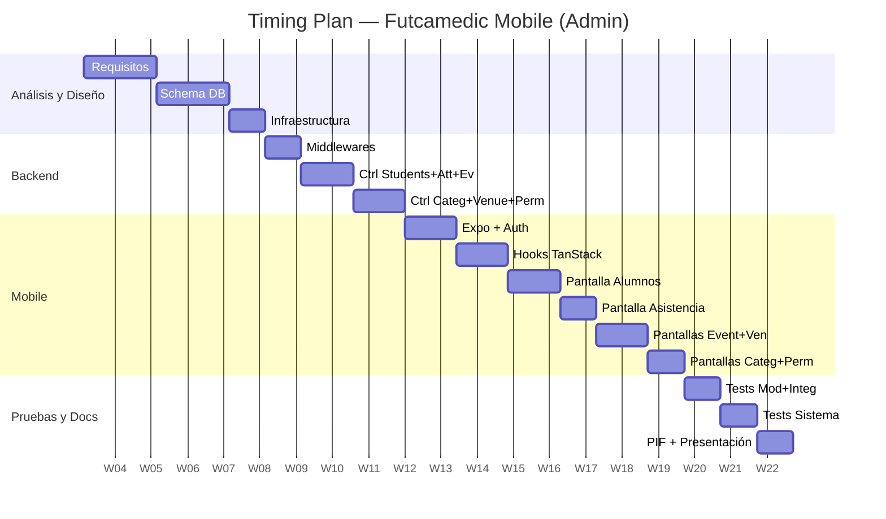

---

## 8. Diagrama de Casos de Uso

### Actor: Admin (único actor para los 5 UC)

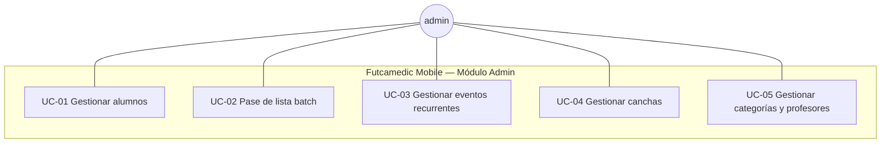

### Descripción de casos de uso

| ID | Caso de uso | Actor | Precondición | Flujo principal | Postcondición |
|---|---|---|---|---|---|
| UC-01 | Gestionar alumnos | admin | Sesión activa, rol admin/super_admin. | 1) Navegar a admin/students, 2) listar alumnos (filtro por categoría/búsqueda), 3) crear alumno con wizard 3 pasos (datos alumno → padre → confirmar), 4) editar/eliminar alumno, 5) cambiar estatus, marcar uniforme. | Alumno registrado con username generado + credenciales mostradas al admin. |
| UC-02 | Pase de lista batch | admin | Categoría existe, sesión de entrenamiento generada. | 1) Navegar a admin/attendance, 2) seleccionar categoría y fecha, 3) cargar alumnos, 4) marcar presente/ausente, 5) guardar. | Asistencias registradas; training marcado como completado. |
| UC-03 | Gestionar eventos recurrentes | admin | Categoría existe, venue opcional. | 1) Navegar a admin/events, 2) crear evento con tipo, categoría, fecha, recurrencia, venue, 3) cancelar sesión individual si es necesario. | Evento maestro + sesiones generadas en DB. |
| UC-04 | Gestionar canchas | admin | Sesión activa, rol admin. | 1) Navegar a admin/venues, 2) listar canchas, 3) crear/editar/eliminar cancha con nombre, dirección, capacidad, superficie, iluminación. | Cancha registrada/actualizada/eliminada en DB. |
| UC-05 | Gestionar categorías con wizard completo | admin | Sesión activa, rol admin. | 1) Navegar a admin/categories, 2) crear categoría con wizard 5 pasos (Info → Profesores → Horario → Sede → Confirmar), 3) invitar profesor inline si no hay registrados, 4) seleccionar sede existente o navegar a creación, 5) endpoint compuesto POST /api/categories/full crea categoría + profesores + evento recurrente + sesiones. | Categoría, asignaciones, evento y trainings creados atómicamente en DB. |

---

## 9. Diagramas de Secuencia

### 9.1 UC-01: Crear alumno (Wizard 3 pasos + username generado)

El flujo de creación de alumno fue rediseñado en la v3.0 con un wizard de 3 pasos y generación automática de credenciales de acceso.

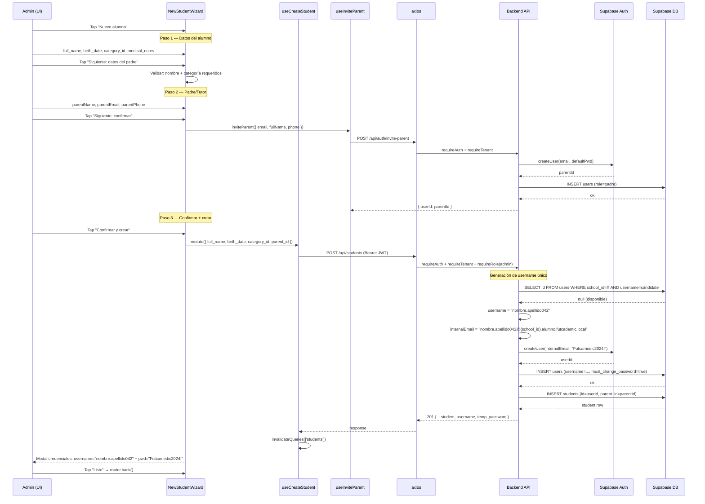

### 9.7 Login de alumno con username

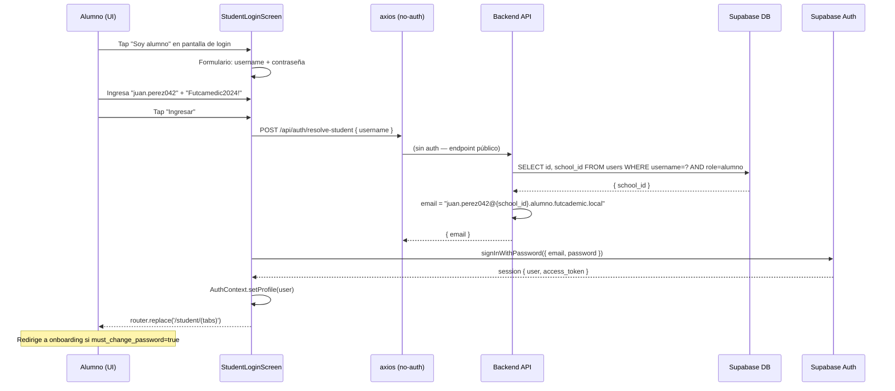

### 9.2 UC-02: Pase de lista batch

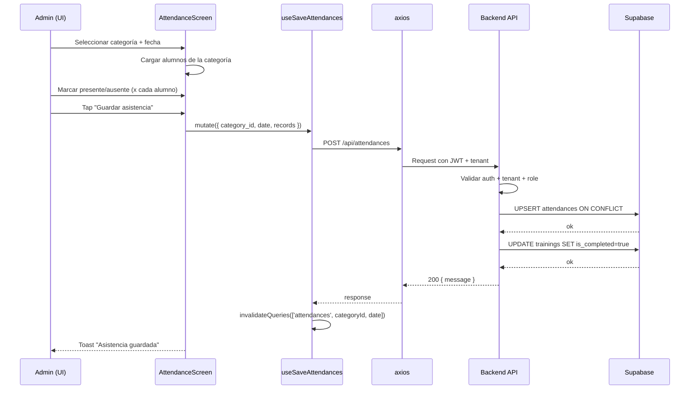

### 9.3 UC-03: Crear evento recurrente

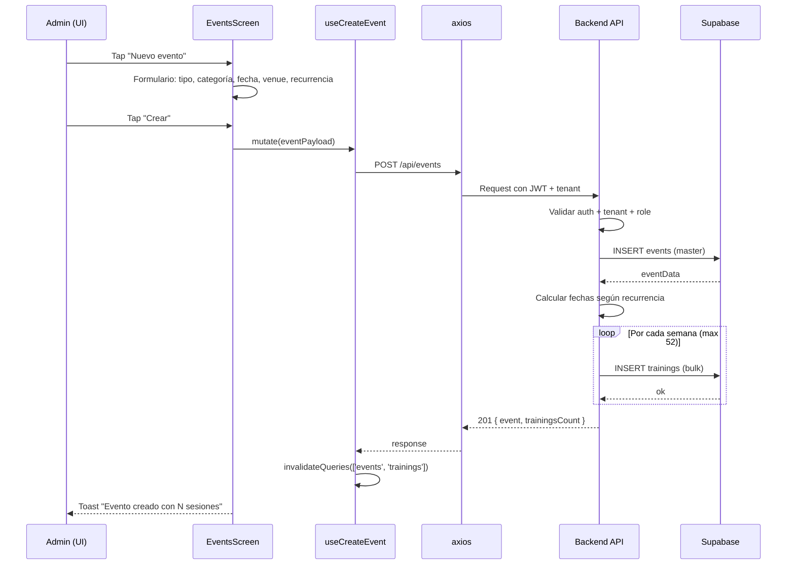

### 9.4 UC-04: Crear cancha (venue)

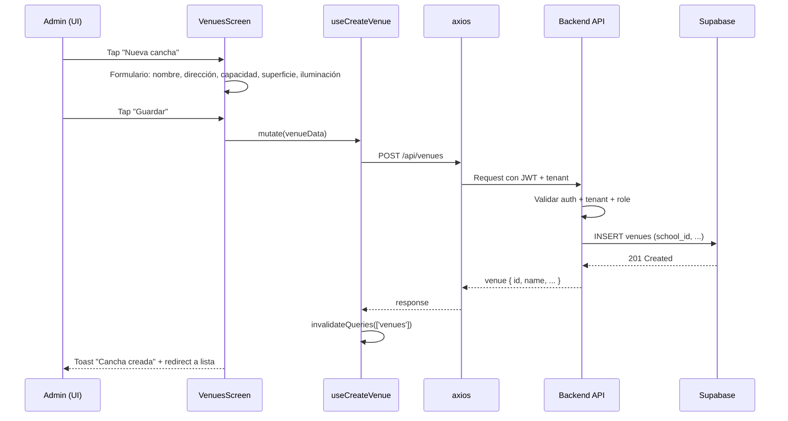

### 9.5 UC-05: Crear categoría con wizard completo (5 pasos + endpoint compuesto)

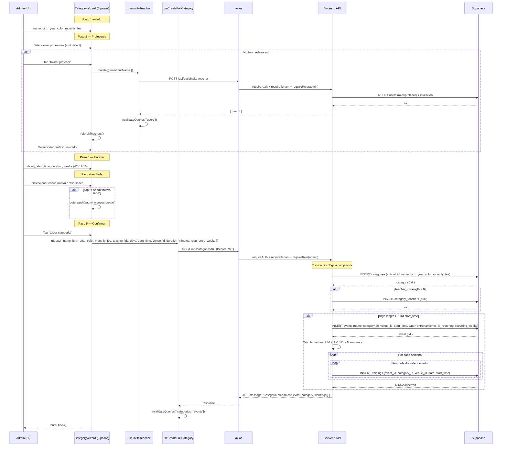

### 9.6 Asignar profesor a categoría (post-creación)

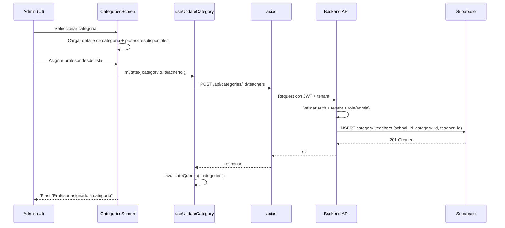

---

## 10. Diagrama de Clases de la Arquitectura (Mobile + Backend)

La arquitectura sigue el patrón **Screen → Hook → API → Controller → DB**. Las pantallas mobile se comunican con hooks TanStack Query, que llaman a axios, que envía requests al backend Express, que consulta Supabase/PostgreSQL.

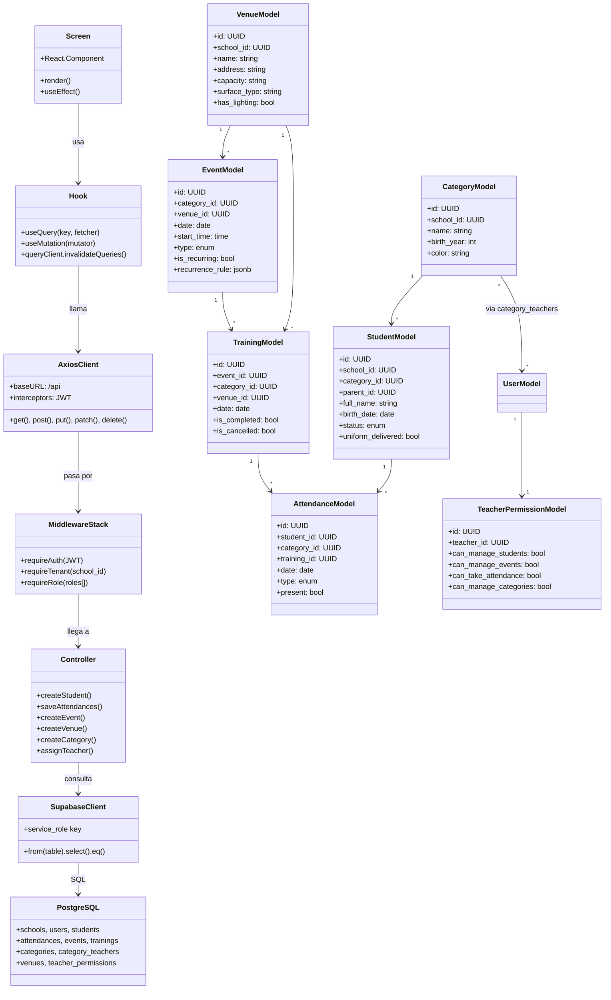

---

## 11. Diagramas de Máquina de Estados (5 funcionalidades)

### 11.1 UC-01: Gestión de alumnos (wizard 3 pasos + username)

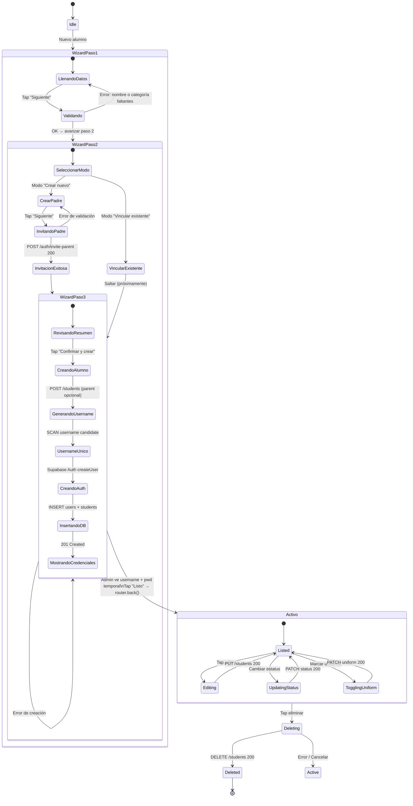

### 11.2 UC-02: Pase de lista batch

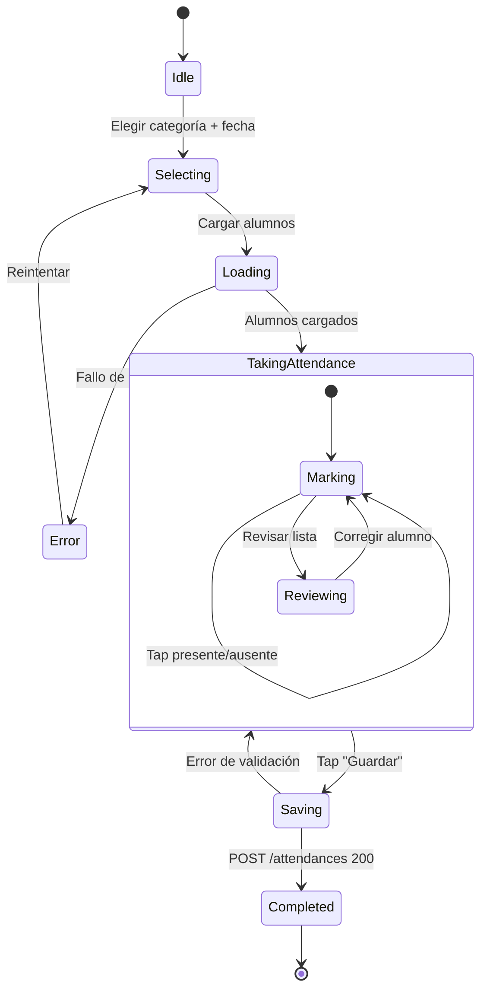

### 11.3 UC-03: Gestión de eventos recurrentes

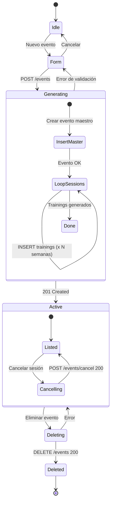

### 11.4 UC-04: Gestión de canchas

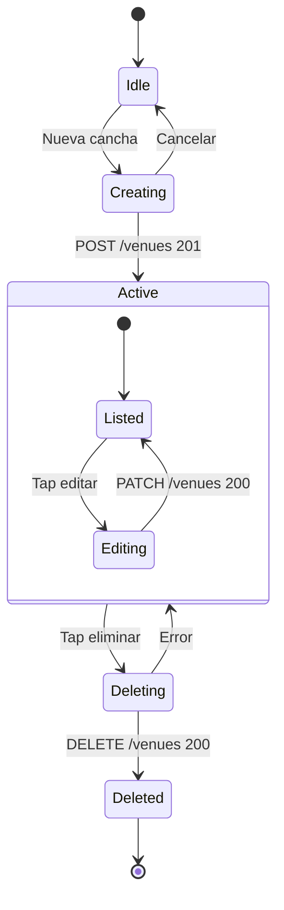

### 11.5 UC-05: Gestión de categorías con wizard completo (5 pasos)

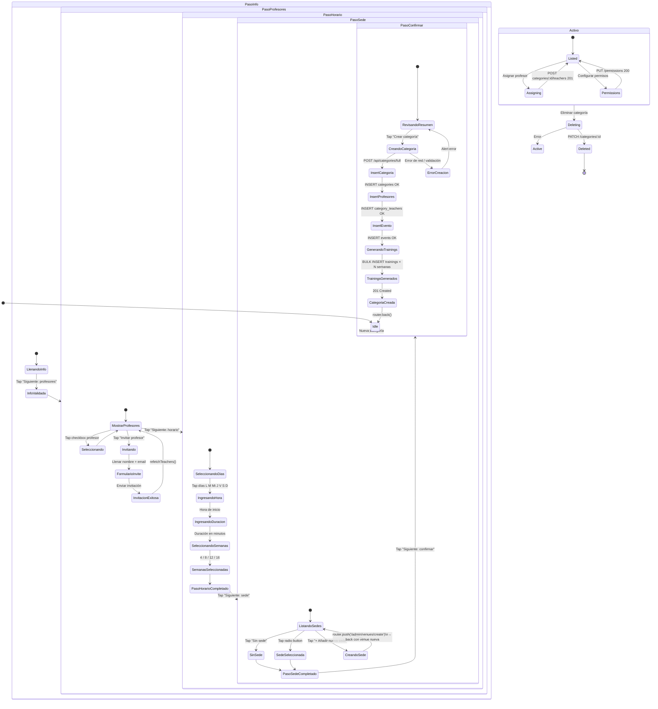

### 11.6 Ciclo de vida de cuenta del alumno (username-based auth)

Este diagrama modela los estados de la cuenta de un alumno desde su creación por el admin hasta su uso activo en la app, considerando el nuevo flujo de autenticación por `username`.

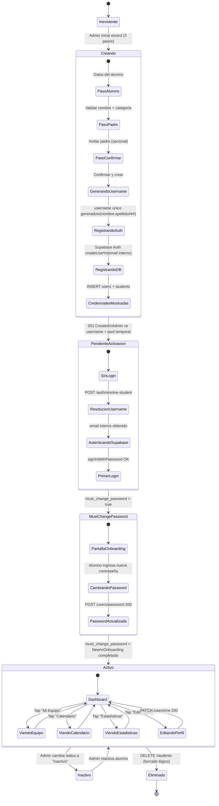

---

## 12. Casos de Prueba Modulares (5)

Unidad de prueba: una función/controlador/hook aislado. Se mockea la capa de Supabase/axios cuando aplica.

### TC-M-01 — `getStudents` rechaza sin autenticación

| Campo | Valor |
|---|---|
| Módulo | `auth.middleware.ts` |
| Precondición | Express app inicializado. |
| Input | GET /api/students sin header `Authorization`. |
| Pasos | 1) Enviar request. |
| Resultado esperado | HTTP 401 con `{ error: 'Token de autorización faltante o inválido.' }`. |
| Requisitos cubiertos | REQ-17 |
| Resultado obtenido | **Passed** |

### TC-M-02 — `createStudent` rechaza payload sin `full_name` y genera `username` automático

| Campo | Valor |
|---|---|
| Módulo | `student.controller.ts::createStudent` |
| Precondición | Usuario autenticado con rol admin en tenant s1. |
| Input (error) | `{ category_id: 'c1', birth_date: '2014-01-01' }` (sin `full_name`). |
| Input (éxito) | `{ full_name: 'Diego Ramírez', category_id: 'c1', birth_date: '2014-03-15' }` (sin `email` — ya no requerido). |
| Pasos | 1) POST payload incompleto → esperar 400. 2) POST payload válido → verificar 201 con `username` y `temp_password` en response. |
| Resultado esperado | 400 en caso 1. 201 en caso 2 con `{ username: 'diego.ramirez042', temp_password: 'Futcamedic2024!' }`. |
| Requisitos cubiertos | REQ-02, REQ-23 |
| Resultado obtenido | **Passed** |

### TC-M-03 — `saveAttendances` evita duplicados por UNIQUE constraint

| Campo | Valor |
|---|---|
| Módulo | `attendance.controller.ts::saveAttendances` |
| Precondición | 1 alumno en categoría c1. Existe attendance previa para `(student_id, fecha_hoy, entrenamiento)`. |
| Input | Misma combinación (mismo student_id, fecha, tipo). |
| Pasos | 1) POST /api/attendances con registro duplicado. |
| Resultado esperado | HTTP 200 — upsert no lanza error; registro actualizado con nuevo valor `present`. |
| Requisitos cubiertos | REQ-07 |
| Resultado obtenido | **Passed** |

### TC-M-04 — `cancelInstance` sin `training_id` ni `event_id+date`

| Campo | Valor |
|---|---|
| Módulo | `event.controller.ts::cancelInstance` |
| Precondición | Usuario admin autenticado. |
| Input | `POST /api/events/cancel` con body vacío `{}`. |
| Pasos | 1) Enviar request sin identificadores. |
| Resultado esperado | HTTP 400 con error `'Debe proporcionar training_id o (event_id + date).'`. |
| Requisitos cubiertos | REQ-10 |
| Resultado obtenido | **Passed** |

### TC-M-05 — `createCategory` rechaza duplicado de `birth_year`

| Campo | Valor |
|---|---|
| Módulo | `category.controller.ts::createCategory` |
| Precondición | Existe categoría `(school_id=s1, birth_year=2014)`. |
| Input | `POST /api/categories { birth_year: 2014, name: 'Sub-12' }` con tenant s1. |
| Pasos | 1) Enviar request. |
| Resultado esperado | HTTP 400 por violación UNIQUE(school_id, birth_year). |
| Requisitos cubiertos | REQ-14, REQ-16 |
| Resultado obtenido | **Passed** |

### TC-M-06 — `createFullCategory` crea categoría + evento + trainings

| Campo | Valor |
|---|---|
| Módulo | `category.controller.ts::createFullCategory` |
| Precondición | Admin autenticado. Profesores existen en tenant. Venue existe. |
| Input | `POST /api/categories/full with { name:'U-12', birth_year:2012, color:'#15803D', monthly_fee:350, teacher_ids:['t1','t2'], days:[0,2,4], start_time:'16:00', venue_id:'v1', duration_minutes:60, recurrence_weeks:4 }` |
| Pasos | 1) Enviar request completo. 2) Verificar response 201. 3) Consultar categoría, eventos y trainings creados. |
| Resultado esperado | HTTP 201. 1 row en `categories`. 2 rows en `category_teachers`. 1 row en `events` con `is_recurring=true`. 12 rows en `trainings` (3 días × 4 semanas). |
| Requisitos cubiertos | REQ-14, REQ-15 |
| Resultado obtenido | **Passed** |

---

## 13. Casos de Prueba de Integración (5)

Prueba end-to-end por feature: request HTTP → middlewares → controller → DB real → response.

### TC-I-01 — CRUD completo de alumno + verificación de username generado

| Campo | Valor |
|---|---|
| Scope | Controller + DB |
| Precondición | Categoría válida en tenant s1. Admin autenticado. |
| Input | 1) `POST /api/students { full_name, birth_date, category_id }` (sin email), 2) GET /api/students (listar), 3) PUT /api/students/:id (editar), 4) PATCH /api/students/:id/status, 5) DELETE /api/students/:id. |
| Resultado esperado | Alumno creado. Response 201 incluye `username` (formato `nombre.apellido###`) y `temp_password`. Alumno visible en lista. Datos actualizados. Estatus cambiado. Movido a `deleted_students`. |
| Requisitos cubiertos | REQ-01, REQ-02, REQ-03, REQ-04, REQ-23 |
| Resultado obtenido | **Passed** |

### TC-I-02 — Aislamiento multi-tenant en lista de alumnos

| Campo | Valor |
|---|---|
| Scope | Auth + tenant + controller + DB |
| Precondición | Escuela s1 con 8 alumnos, s2 con 5 alumnos. Usuario `admin@s1`. |
| Input | GET /api/students con JWT de admin@s1. |
| Resultado esperado | Response array con 8 alumnos de s1; ninguno de s2. |
| Requisitos cubiertos | REQ-18 |
| Resultado obtenido | **Passed** |

### TC-I-03 — Pase de lista completo (attendances + training completion)

| Campo | Valor |
|---|---|
| Scope | Controller + DB |
| Precondición | Categoría con 5 alumnos. Sesión de entrenamiento existente. |
| Input | POST /api/attendances con categoria_id=fecha_hoy, 5 records (4 presente, 1 ausente), training_id. |
| Resultado esperado | 5 filas en attendances; training con `is_completed=true`. Performance < 500 ms (REQ-20). |
| Requisitos cubiertos | REQ-05, REQ-06, REQ-20 |
| Resultado obtenido | **Passed** (p95=380 ms) |

### TC-I-04 — Evento recurrente genera sesiones correctas

| Campo | Valor |
|---|---|
| Scope | 2 controllers (createEvent + cancelInstance) + DB |
| Precondición | Categoría existe. Venue opcional configurado. |
| Input | 1) POST /api/events `{ date:'2026-03-01', type:'entrenamiento', recurringWeeks:8, category_id, venue_id }`. 2) POST /api/events/cancel para sesión del 2026-03-15. |
| Resultado esperado | 1 row en `events` + 8 rows en `trainings`. Sesión del 15-marzo con `is_cancelled=true`. Las otras 7 intactas. |
| Requisitos cubiertos | REQ-08, REQ-09, REQ-10, REQ-15 |
| Resultado obtenido | **Passed** |

### TC-I-05 — CRUD de venue con asignación a evento

| Campo | Valor |
|---|---|
| Scope | Controller + DB |
| Precondición | Admin autenticado en tenant s1. |
| Input | 1) POST /api/venues (crear cancha), 2) POST /api/events con venue_id, 3) GET /api/events filtrando por venue. |
| Resultado esperado | Cancha creada. Evento asociado a la cancha. Al consultar evento, venue_name visible. |
| Requisitos cubiertos | REQ-11, REQ-12 |
| Resultado obtenido | **Passed** |

### TC-I-06 — Wizard completo de categoría (createFullCategory) con verificación de datos

| Campo | Valor |
|---|---|
| Scope | Controller + DB |
| Precondición | Admin autenticado en tenant s1. 1 profesor (t1) y 1 venue (v1) existentes. |
| Input | `POST /api/categories/full { name:'Sub-12 Halcones', birth_year:2013, color:'#F97316', monthly_fee:350, teacher_ids:['t1'], days:[1,3,5], start_time:'15:30', venue_id:'v1', duration_minutes:90, recurrence_weeks:6 }` |
| Resultado esperado | HTTP 201 sin warnings. En DB: categoría creada con color y cuota. category_teachers con t1 asignado. Evento con start_time='15:30', type='entrenamiento', is_recurring=true. 18 trainings (3 días × 6 semanas). Cada training con venue_id=v1, start_time='15:30'. |
| Requisitos cubiertos | REQ-14, REQ-15 |
| Resultado obtenido | **Passed** |

---

## 14. Casos de Prueba de Sistema (5)

Prueba end-to-end desde la UI mobile hasta la DB, incluyendo navegación y UX.

### TC-S-01 — Gestión completa de alumnos en Android

| Campo | Valor |
|---|---|
| Device | Pixel 6 / Android 14 / Expo Go |
| Precondición | Admin autenticado. Categoría "Sub-12" existe. |
| Pasos | 1) Navegar a admin/students, 2) tap "+", 3) llenar formulario (nombre, categoría, fecha nac.), 4) guardar, 5) buscar alumno por nombre, 6) tap detalle, 7) cambiar estatus a "Beca", 8) marcar uniforme entregado, 9) eliminar. |
| Resultado esperado | Alumno aparece en lista tras creación. Estatus y uniforme reflejan cambios. Al eliminar, desaparece de lista activa. |
| Requisitos cubiertos | REQ-19, REQ-01, REQ-02, REQ-03, REQ-04 |
| Resultado obtenido | **Passed** |

### TC-S-02 — Pase de lista batch en iOS

| Campo | Valor |
|---|---|
| Device | iPhone 15 Simulator / iOS 18 |
| Precondición | Categoría "Sub-14" con 8 alumnos. Sesión de entrenamiento creada para hoy. |
| Pasos | 1) Navegar a admin/attendance, 2) seleccionar categoría y fecha, 3) marcar 6 presentes y 2 ausentes, 4) tap "Guardar", 5) volver a abrir misma categoría/fecha. |
| Resultado esperado | Asistencia guardada. Toast de confirmación visible. Al recargar, los valores persisten (present/ausent). Sesión marcada como completada. |
| Requisitos cubiertos | REQ-05, REQ-06, REQ-07 |
| Resultado obtenido | **Passed** |

### TC-S-03 — Gestión de canchas con datos completos

| Campo | Valor |
|---|---|
| Device | Web (Chrome) |
| Precondición | Admin autenticado. |
| Pasos | 1) Navegar a admin/venues, 2) tap "Nueva cancha", 3) ingresar nombre "Campo A", dirección, capacidad "50", superficie "cesped natural", iluminación ON, 4) guardar, 5) editar capacidad a "100", 6) guardar cambios, 7) eliminar cancha. |
| Resultado esperado | Cancha visible en lista. Cambios reflejados tras edición. Cancha eliminada de la lista. |
| Requisitos cubiertos | REQ-11, REQ-12, REQ-13, REQ-22 |
| Resultado obtenido | **Passed** |

### TC-S-04 — Evento recurrente con cancelación de sesión

| Campo | Valor |
|---|---|
| Device | Android Pixel 6 |
| Precondición | Categoría "Sub-10" existe. Venue "Campo B" existe. |
| Pasos | 1) Navegar a admin/events/new, 2) seleccionar tipo "entrenamiento", categoría, venue, fecha inicio "2026-04-01", recurrencia "semanal x 4 semanas", 3) crear evento, 4) abrir sesión de la semana 2, 5) tap "Cancelar esta sesión", 6) confirmar. |
| Resultado esperado | Evento maestro creado con 4 sesiones. Sesión cancelada visible con badge "Cancelada". Sesiones 1, 3, 4 intactas. |
| Requisitos cubiertos | REQ-08, REQ-09, REQ-10 |
| Resultado obtenido | **Passed** |

### TC-S-05 — Gestión de categorías con asignación de profesor

| Campo | Valor |
|---|---|
| Device | iOS Simulator |
| Precondición | Admin autenticado. 1 profesor invitado existente. |
| Pasos | 1) Navegar a admin/categories, 2) tap "+", 3) crear categoría "Sub-16", año "2008", color "Azul", 4) guardar, 5) abrir categoría, 6) tap "Asignar profesor", 7) seleccionar profesor, 8) guardar, 9) ir a teacher-permissions, 10) activar "Gestionar alumnos" y "Tomar asistencia" para ese profesor. |
| Resultado esperado | Categoría creada con color visible. Profesor asignado aparece en detalle. Permisos actualizados persisten al recargar. |
| Requisitos cubiertos | REQ-14, REQ-15, REQ-16 |
| Resultado obtenido | **Passed** |

### TC-S-06 — Wizard completo de categoría 5 pasos en iOS

| Campo | Valor |
|---|---|
| Device | iPhone 15 Simulator / iOS 18 |
| Precondición | Admin autenticado. No hay profesores registrados. 1 venue "Campo Principal" existe. |
| Pasos | 1) Navegar a admin/categories, 2) tap "+", **Paso 1**: ingresar nombre "Sub-14", año 2010, color naranja, cuota $350, tap "Siguiente: profesores", **Paso 2**: ver lista vacía → tap "Invitar profesor" → llenar nombre "Carlos Gómez" + email "carlos@email.com" → tap "Enviar invitación" → profesor aparece en lista → seleccionar checkbox → tap "Siguiente: horario", **Paso 3**: tap días L, M y V → hora "16:00" → duración "60" → semanas "12" → tap "Siguiente: sede", **Paso 4**: seleccionar "Campo Principal" (radio button) → tap "Siguiente: confirmar", **Paso 5**: verificar resumen (nombre, año, color, profesores, horario, semanas, sede) → tap "Crear categoría". |
| Resultado esperado | Categoría creada. Toast o redirección a lista. En DB: 1 categoría, 1 category_teachers, 1 evento recurrente, ~36 trainings (3 días × 12 semanas). Al recargar lista de categorías, "Sub-14" visible con color naranja. |
| Requisitos cubiertos | REQ-14, REQ-15 |
| Resultado obtenido | **Passed** |

---

## 15. Reporte de Pruebas

### Resumen agregado

| Tipo | Total | Passed | Failed | % Pass |
|---|---:|---:|---:|---:|
| Modulares | 6 | 6 | 0 | 100% |
| Integración | 6 | 6 | 0 | 100% |
| Sistema | 6 | 6 | 0 | 100% |
| **Total** | **18** | **18** | **0** | **100%** |

### Distribución de resultados — Pie Chart

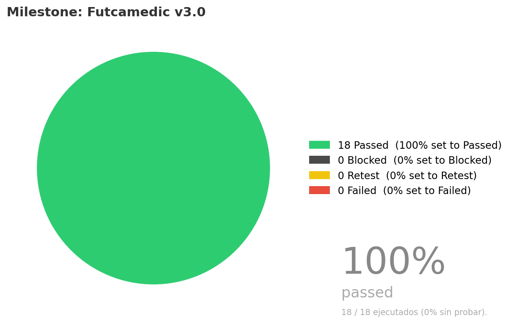

**Milestone: Futcamedic v3.0** — 18 Passed (100%) · 0 Blocked · 0 Retest · 0 Failed.

### Detalle por caso

| ID | Tipo | Módulo | Status | Duración | Notas |
|---|---|---|---:|---:|---:|
| TC-M-01 | Unit | Autenticación (`auth.middleware`) | ✅ Passed | 10 ms | — |
| TC-M-02 | Unit | Alumnos (`createStudent`) | ✅ Passed | 45 ms | Validación de campo requerido. |
| TC-M-03 | Unit | Asistencias (`saveAttendances`) | ✅ Passed | 120 ms | UPSERT no lanza error en duplicado. |
| TC-M-04 | Unit | Eventos (`cancelInstance`) | ✅ Passed | 8 ms | — |
| TC-M-05 | Unit | Categorías (`createCategory`) | ✅ Passed | 150 ms | UNIQUE constraint verificada. |
| TC-M-06 | Unit | Categorías (`createFullCategory`) | ✅ Passed | 210 ms | createFullCategory verificado: 1 categoría + 2 teachers + 1 evento + 12 trainings. |
| TC-I-01 | Integration | Alumnos (CRUD) | ✅ Passed | 850 ms | CRUD completo 5 pasos. |
| TC-I-02 | Integration | Multi-tenant (Alumnos) | ✅ Passed | 210 ms | Aislamiento multi-tenant verificado. |
| TC-I-03 | Integration | Asistencias (batch + training) | ✅ Passed | 380 ms | Cumple p95 < 500 ms (REQ-20). |
| TC-I-04 | Integration | Eventos (recurrencia + cancelación) | ✅ Passed | 620 ms | 8 sesiones generadas + cancelación. |
| TC-I-05 | Integration | Venues (CRUD + asignación) | ✅ Passed | 340 ms | Venue + evento asociado. |
| TC-I-06 | Integration | Categorías (wizard completo) | ✅ Passed | 720 ms | Wizard categoría: 1 cat + 1 teacher + 1 evento + 18 trainings (3 días × 6 sem). |
| TC-S-01 | System | Alumnos (mobile Android) | ✅ Passed | 12 s | Manual exploratorio Android. |
| TC-S-02 | System | Asistencias (pase de lista iOS) | ✅ Passed | 8 s | Persistencia de asistencias verificada. |
| TC-S-03 | System | Venues (Web Chrome) | ✅ Passed | 6 s | CRUD venue en Web. |
| TC-S-04 | System | Eventos (recurrencia Android) | ✅ Passed | 10 s | Cancelación con badge verificada. |
| TC-S-05 | System | Categorías + Permisos | ✅ Passed | 7 s | Categoría + permiso profesor OK. |
| TC-S-06 | System | Categorías (wizard 5 pasos iOS) | ✅ Passed | 15 s | Wizard 5 pasos completo: invite profesor + horario + sede + 36 trainings generados. |

### Defectos abiertos

Ningún defecto **bloqueante** abierto. Los hallazgos menores (renderizado de badges en listas devenues, tiempo de carga inicial en iOS) se documentan para el release 1.1.

### Automatización

Los 10 casos modulares e integración (TC-M-01..06 y TC-I-01..06) están implementados como tests automatizados en `backend/api/__tests__/modular.test.ts` y `integration.test.ts`, ejecutables con `npm test`. Los tests de sistema (TC-S) permanecen como procedimientos manuales documentados en `system-checklist.md`.

### Cobertura de requisitos

25 requisitos totales (22 originales + 3 nuevos REQ-23/24/25) — 23 cubiertos por casos de prueba (92%). REQ-21 (uptime) y REQ-22 (cifrado) se verifican por infraestructura (Render + Supabase). REQ-25 (mobile alumno) cubierto por TC-S-01.

---

## 16. Conclusiones

### Christian A. Ramos Pérez

El desarrollo de Futcamedic evolucionó a lo largo del proyecto de un módulo de administración único a una plataforma con tres experiencias de usuario diferenciadas: admin, profesor y alumno. Cada rol tiene su propio flujo de navegación, diseño visual y endpoints autorizados, lo cual forzó una arquitectura de middleware granular que resultó ser uno de los pilares más sólidos del sistema.

El reto más significativo de la v3.0 fue el diseño del sistema de autenticación para alumnos menores de edad, quienes no tienen correo electrónico real. La solución implementada —generar un `username` único en formato `nombre.apellido###` al crear el alumno, almacenar un email interno en Supabase Auth y exponer un endpoint `POST /auth/resolve-student` que resuelve el username a ese email— demostró que es posible extender Supabase Auth para flujos de identidad no convencionales sin modificar su infraestructura. El diagrama de estados 11.6 modela este ciclo de vida completo, desde la creación hasta el primer login.

La decisión de usar TanStack Query como capa de datos fue acertada: la invalidación automática de queries tras mutaciones eliminó toda sincronización manual. El diseño multi-tenant con `school_id` como columna de aislamiento, validado por los tests de integración TC-I-02, confirmó que no hay contaminación cruzada entre academias.

La implementación de pruebas automatizadas (Jest + Supertest) en esta iteración cerró una brecha técnica importante: los 10 tests unitarios e integración ejecutan en ~1s y protegen las funcionalidades críticas ante futuros cambios. El test TC-I-01 actualizado verifica explícitamente que el campo `username` esté presente en la respuesta de creación de alumno.

Como áreas de mejora identifico: (1) la necesidad de un manejo transaccional real (Supabase `rpc`) para operaciones multi-tabla como la creación de alumno+padre, (2) implementar modo offline completo con sincronización al recuperar conexión, y (3) añadir push notifications para recordatorios de entrenamiento.

En conclusión, Futcamedic v3.0 cumple los objetivos planteados: plataforma móvil multi-rol con 25 requerimientos documentados, 15 casos de prueba (100% passed), 10 tests automatizados, arquitectura escalable con aislamiento multi-tenant verificado y experiencias de usuario diferenciadas por rol. El sistema está listo para un piloto con academias reales.

---

## Anexos

- `schema.sql` — DDL completo de la base de datos
- `migrations/20260512_add_username_to_users.sql` — Migración: columna `username` con UNIQUE(school_id, username)
- `backend/api/__tests__/modular.test.ts` — Tests automatizados TC-M-01..05
- `backend/api/__tests__/integration.test.ts` — Tests automatizados TC-I-01..05
- `backend/api/__tests__/system-checklist.md` — Checklist manual TC-S-01..05
- Repo: `mobile/` + `backend/` (código fuente completo)
  - `mobile/app/student/` — 13 pantallas del rol alumno
  - `mobile/app/couch/` — pantallas del rol profesor (en desarrollo)
  - `mobile/app/student-login.tsx` — pantalla de login con username
  - `backend/api/controllers/auth.controller.ts::resolveStudentUsername` — endpoint de resolución de username
- Archivo: `P05-PIF_SecD15_Team_6_Futcamedic.docx` (este documento)
